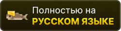
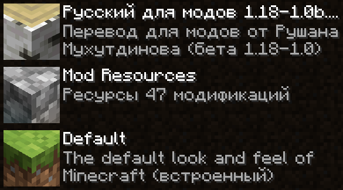

# Русский перевод модификаций для Minecraft от Дефлекты

    
     
     
    
    
    
     
     
    <!---->

Меня не устраивало то, какой обычно бывает перевод на русский в модах для Minecraft, и поэтому я решил сам улучшить их переводы, а также добавить русский перевод туда, где его нет.

Это набор ресурсов, разрабатываемый для версий Minecraft от 1.16.x до 1.20.x, затрагивающий перевод модов, сделанных под загрузчики Forge, Fabric, Quilt и NeoForge.

Помимо русского языка в наборе планируются переводы и на остальные языки, используемые в России, Беларуси и Украине. Например, в определённых версиях этого набора уже включены переводы некоторых модификаций на татарский и украинский языки.

## ⚙️ Что затронуто

Раскрыть список

 

* `1.16—1.20` — версии игры;
* 🌌 — модификации нет на эту версию.
* ❌ — перевода пока нет;
* ✅ — перевод готов.

| Модификация | 1.16 | 1.17 | 1.18 | 1.19 | 1.20 |
| - | - | - | - | - | - |
| [Additional Additions](https://modrinth.com/mod/addadd) | 🌌 | ❌ | ✅ Русский ✅ Татарский | ✅ Русский ✅ Татарский | ✅ Русский
| [AFMP: A Few More Plushies](https://modrinth.com/mod/afmp) | 🌌 | 🌌 | 🌌 | ✅ Русский | ❌
| [All the Fan Made Discs](https://modrinth.com/mod/all-the-fan-made-discs) | 🌌 | 🌌 | ❌ | ❌ | ✅ Русский
| [AppleSkin](https://modrinth.com/mod/appleskin) | ✅ Русский | ❌ | ❌ | ✅ Русский | ❌
| [Applied Energistics 2](https://modrinth.com/mod/ae2) | ❌ В процессе | ✅ Русский | ❌ | ❌ | ❌
| [Automatic Tool Swap](https://www.curseforge.com/minecraft/mc-mods/automatic-tool-swap) | ❌ | ✅ Русский | ❌ | ❌ | ❌
| [Bad Wither No Cookie - Reloaded](https://modrinth.com/mod/bad-wither-no-cookie) | ❌ | ❌ | ❌ | ❌ | ✅ Русский
| [Better Biome Blend](https://modrinth.com/mod/better-biome-blend) | ❌ | ✅ Русский | ❌ | ❌ | 🌌
| [Better Mods Button](https://www.curseforge.com/minecraft/mc-mods/better-mods-button) | ❌ | ✅ Русский | ❌ | ❌ | ❌
| [Bookshelf](https://modrinth.com/mod/bookshelf-lib) | ✅ Русский | ❌ | ❌ | ❌ | ❌
| [Canvas Renderer](https://modrinth.com/mod/canvas) | 🌌 | ❌ | ❌ | ❌ | ❌ В процессе
| [Catalogue](https://www.curseforge.com/minecraft/mc-mods/catalogue) | ✅ Русский | ✅ Русский | ❌ | ❌ | ❌
| [Cave Dweller](https://modrinth.com/mod/cave-dweller-fabric) [Cave Dweller Evolved](https://modrinth.com/mod/cave-dweller-evolved) | ❌ | ❌ | ❌ | ✅ Русский | ✅ Русский
| [Chat Heads](https://modrinth.com/mod/chat-heads) | ❌ | ❌ | ❌ | ❌ | ✅ Русский
| [Clear Despawn](https://modrinth.com/mod/cleardespawn) | ❌ | ❌ | ❌ | ❌ | ✅ Русский
| [Cloth Config API](https://modrinth.com/mod/cloth-config) | ✅ Русский | ❌ | ❌ | ❌ | ✅ Русский
| [Cobblemon](https://modrinth.com/mod/cobblemon) | ❌ | ❌ | ❌ | ❌ | ❌ В процессе
| [Configured](https://www.curseforge.com/minecraft/mc-mods/configured) | ❌ | ✅ Русский | ❌ | ❌ | ❌
| [Controlling](https://modrinth.com/mod/controlling) | ❌ | ❌ | ❌ | ✅ Русский | ❌
| [Cosmetic Armor Reworked](https://www.curseforge.com/minecraft/mc-mods/cosmetic-armor-reworked) | ❌ | ✅ Русский | ❌ | ❌ | ❌
| [Cosmetic Armor](https://modrinth.com/mod/cosmetic-armor) | ❌ | ❌ | ❌ | ❌ | ✅ Русский
| [CreRaces](https://modrinth.com/mod/creraces) | ❌ | ❌ В процессе | ❌ | ❌ | ❌
| [Delightful Creators](https://modrinth.com/mod/delightful-creators-fabric) | ❌ | ❌ | ❌ | ❌ | ❌ В процессе
| [Domestication Innovation](https://www.curseforge.com/minecraft/mc-mods/domestication-innovation) | ❌ | ❌ | ✅ Русский | ❌ | ❌
| [e4mc](https://modrinth.com/mod/e4mc) | ❌ | ✅ Русский ✅ Украинский | ✅ Русский ✅ Украинский | ✅ Русский ✅ Украинский | ✅ Русский ✅ Украинский |
| [Enchantment Descriptions](https://www.curseforge.com/minecraft/mc-mods/enchantment-descriptions) | ❌ | ✅ Русский | ❌ | ❌ | ❌
| [Endless Music](https://modrinth.com/mod/endless-music) | ❌ | ❌ | ❌ | ❌ | ✅ Русский
| [Enhanced Attack Indicator](https://modrinth.com/mod/enhanced-attack-indicator) | ❌ | ❌ | ❌ | ❌ | ✅ Русский
| [Entity Culling](https://modrinth.com/mod/entityculling) | ❌ | ❌ | ❌ | ❌ | ✅ Русский
| [FastWorkbench](https://www.curseforge.com/minecraft/mc-mods/fastworkbench) | ❌ | ❌ В процессе | ❌ | ❌ | ❌
| [Forge](https://files.minecraftforge.net/net/minecraftforge/forge) | ❌ | ❌ В процессе | ✅ Русский | ✅ Русский | ❌
| [Full Brightness Toggle](https://modrinth.com/mod/full-brightness-toggle) | ❌ | ❌ | ❌ | ❌ | ✅ Русский
| [Idwtialsimmoedm](https://modrinth.com/mod/idwtialsimmoedm) | ❌ | ❌ | ✅ Русский | ❌ В процессе | ✅ Русский
| [Immersive Petroleum](https://www.curseforge.com/minecraft/mc-mods/immersive-petroleum) | ❌ | ❌ | ❌ | ❌ | ❌
| [Iris Shaders](https://modrinth.com/mod/iris) | ❌ | ❌ | ❌ | ❌ | ❌ В процессе
| [Jade 🔍](https://modrinth.com/mod/jade) | ❌ | ❌ В процессе | ❌ | ❌ | ❌
| [Just Enough Advancements](https://www.curseforge.com/minecraft/mc-mods/jea) | ❌ | ❌ В процессе | ❌ | ❌ | ❌
| [Just Enough Resources](https://modrinth.com/mod/just-enough-resources-jer) | ❌ | ❌ В процессе | ❌ | ❌ | ❌
| [Kawaii Dishes](https://modrinth.com/mod/kawaii-dishes) | ❌ | ❌ | ❌ В процессе | ❌ В процессе | ❌ В процессе
| [LibJF](https://modrinth.com/mod/libjf) | ❌ | ❌ | ❌ | ❌ | ✅ Русский
| [Litematica](https://litematica.org) | ❌ | ❌ | ❌ | ✅ Русский | ❌
| [Look](https://modrinth.com/mod/look) | ❌ | ❌ | ❌ | ❌ | ✅ Русский
| [Lucky Block](https://www.curseforge.com/minecraft/mc-mods/lucky-block) | ❌ | ❌ | ✅ Русский ✅ Татарский | ❌ | ❌
| [Lycanthropy](https://modrinth.com/mod/lycanthropy) | ❌ | ❌ | ❌ | ❌ | ✅ Русский
| [Make Bubbles Pop](https://modrinth.com/mod/make_bubbles_pop) | ❌ | ❌ | ❌ | ❌ | ✅ Русский
| [MarbleGate's Exotic Enchantment: Flowing Agony](https://modrinth.com/mod/flowing-agony) | ❌ | ❌ В процессе | ❌ | ❌ | ❌ В процессе
| [Mica](https://modrinth.com/mod/mica) | ❌ | ❌ | ❌ | ❌ | ✅ Русский
| [Mod Menu](https://modrinth.com/mod/modmenu) | ❌ | ❌ | ✅ Русский | ✅ Русский | ❌ В процессе
| [More Music Discs](https://modrinth.com/mod/more-music-discs) | ❌ | ❌ | ❌ | ❌ | ✅ Русский
| [NEEPMeat](https://modrinth.com/mod/neepmeat) | ❌ | ❌ | ❌ | ❌ | ❌ В процессе
| [Neighborly](https://www.curseforge.com/minecraft/mc-mods/neighborly) | ❌ | ❌ | ❌ | ❌ В процессе | ❌ В процессе
| [NeoForge](https://neoforged.net) | ❌ | ❌ | ❌ | ❌ | ❌ В процессе
| [Nevermore!](https://modrinth.com/datapack/nevermore) | ❌ | ❌ | ❌ | ❌ | ❌ В процессе
| [Raised](https://modrinth.com/mod/raised) | ❌ | ❌ | ❌ | ❌ | ❌
| [Rats](https://modrinth.com/mod/rats) | ❌ | ❌ | ❌ | ❌ | ❌ В процессе
| [Regions Unexplored](https://modrinth.com/mod/regions-unexplored) | ❌ | ❌ | ❌ | ❌ В процессе | ❌
| [Respackopts](https://modrinth.com/mod/respackopts) | ❌ | ❌ | ❌ | ❌ | ✅ Русский
| [Rotten Creatures](https://modrinth.com/mod/rottencreatures) | ❌ | ❌ | ✅ Русский | ✅ Русский | ❌
| [Roughly Enough Items](https://modrinth.com/mod/rei) | ❌ | ❌ | ❌ | ❌ | ❌ В процессе
| [Simple Corinthium](https://www.curseforge.com/minecraft/mc-mods/simple-corinthium) | ❌ | ❌ | ✅ Русский | ✅ Русский | ❌
| [Simple Weapons for Better Combat](https://www.curseforge.com/minecraft/mc-mods/simple-weapons-for-better-combat) | ❌ | ❌ | ✅ Русский | ✅ Русский | ❌
| [Simply Status](https://modrinth.com/mod/simplystatus) | ❌ | ❌ | ❌ | ❌ | ✅ Русский
| [Smooth Boot (Fabric)](https://modrinth.com/mod/smoothboot-fabric) [Smooth Boot (Reloaded)](https://modrinth.com/mod/smooth-boot-reloaded) | ❌ | ❌ | ❌ | ✅ Русский | ❌
| [Sodium Extra](https://modrinth.com/mod/sodium-extra) | ❌ | ❌ | ❌ | ❌ | ❌ В процессе
| [Sodium](https://modrinth.com/mod/sodium) | ❌ | ✅ Русский | ✅ Русский | ✅ Русский | ❌ В процессе
| [Sulfur Based Weapon Development](https://modrinth.com/mod/sbwd) | ❌ | ❌ | ❌ | ✅ Русский | ❌
| [Tech Reborn](https://www.curseforge.com/minecraft/mc-mods/techreborn) | ❌ | ❌ | ❌ | ❌ | ❌ В процессе
| [The Dark Dweller](https://modrinth.com/mod/the-dark-dweller) | ❌ | ❌ | ❌ | ✅ Русский | ❌
| [The Fellow Furries Mod](https://modrinth.com/mod/fellowfurriesmod) | ❌ | ❌ | ❌ | ❌ | ✅ Русский
| [Thigh highs etc.](https://modrinth.com/mod/thigh-highs-etc) | ❌ | ❌ | ❌ | ❌ | ✅ Русский
| [Title Fixer](https://modrinth.com/mod/title-fixer) | ❌ | ❌ | ❌ | ❌ | ✅ Русский
| [Tool Stats](https://modrinth.com/mod/tool-stats) | ❌ | ❌ | ❌ | ❌ | ✅ Русский
| [Touhou Little Maid](https://modrinth.com/mod/touhou-little-maid) | ❌ | ❌ | ❌ | ❌ | ❌ В процессе

Список будет пополняться.

## 🚀 Установка

Скачать набор ресурсов можно [здесь в Гитхабе со списка выпусков](https://github.com/RushanM/Minecraft-Mods-Russian-Translation/releases) или со следующих сайтов:

<a href="https://ru-minecraft.ru/bezdna/79004-russkiy-perevod-modifikaciy-ot-deflekty-116.html">
    ру Майнкрафт
</a>

> Если не можете решиться, откуда скачивать, скачивайте с Modrinth. Сайт — конфетка!

### 🏷️ Версии

Есть несколько версий набора и я приписываю к каждой версии свой номер. Например, «1.18-1.0» в названии набора расшифровывается как «редакция 1.0 для Minecraft 1.18». Я не могу разом перевести все модификации и поэтому я выпускаю наборы в виде отдельных *редакций* — пачек переводов для конкретных модификаций, которые я успел перевести. Каждая новая редакция, начиная с 1.0 и далее по порядку, включает в себя все предыдущие переводы (с возможными изменениями) и обязательно добавляет новые.

<!-- ### Скачивание

Поместите скачанный архив в папку resourcepacks в папке .minecraft.

Включите набор в игре. -->

### 📋 Порядок

Чтобы набор имел возможность изменять перевод модификаций, он должен стоять выше набора ресурсов модификаций. Например, у Forge он называется Mod Resources.

    

### 🔁 Поддержка модификаций
#### 📃 [Better Resource Pack Sorting](https://modrinth.com/mod/better-resource-pack-sorting)
Если вы установите эту модификацию, у русификатора будет более красивое название.
#### 🔄 [DynamicPack](https://modrinth.com/mod/dynamicpack)
Если вы установите эту модификацию, русификатор всегда будет обновляться до последней редакции и вам не нужно будет следить за тем, когда выйдет новая.
#### ⚙️ [Respackopts](https://modrinth.com/mod/respackopts)
В разработке.

## 📛 Авторы

* [**Дефлекта**](https://github.com/RushanM): Делает этот набор ресурсов
* [**1the_same_cat1**](https://www.curseforge.com/members/1the_same_cat1): Перевёл на русский модификации 
* * [*Simple Corinthium*](https://www.curseforge.com/minecraft/mc-mods/simple-corinthium)
* * [*Simple Weapons for Better Combat*](https://www.curseforge.com/minecraft/mc-mods/simple-weapons-for-better-combat)
* * [*Rotten Creatures*](https://modrinth.com/mod/rottencreatures)
* [**Inqurity**](https://github.com/Inqurity): Перевёл на русский и украинский модификации
* * [*Idwtialsimmoedm*](https://modrinth.com/mod/idwtialsimmoedm)
* * [*e4mc*](https://modrinth.com/mod/e4mc)
* [**devin**](https://github.com/intergrav): Создал дизайн [кнопок](https://github.com/intergrav/devins-badges), используемых в этом README

## ✉️ Контакты
Есть личная просьба, предложение или любая другая причина обратиться лично ко мне? Вы можете написать мне в одной из этих сетей:
* ВКонтакте: **`deflecta`**
* Дискорд: **`deflecta`**
* Телеграм: **`RMKHTDNV`**

## 💝 Материальная поддержка

Если моя работа нравится вам настолько, что вы готовы отправить мне деньги, можно сделать это по следующим ссылкам:

* VK Pay: <https://vk.me/moneysend/deflecta>
* ЮMoney: <https://yoomoney.ru/to/410015215253910>

Буду благодарен за каждый рубль!
