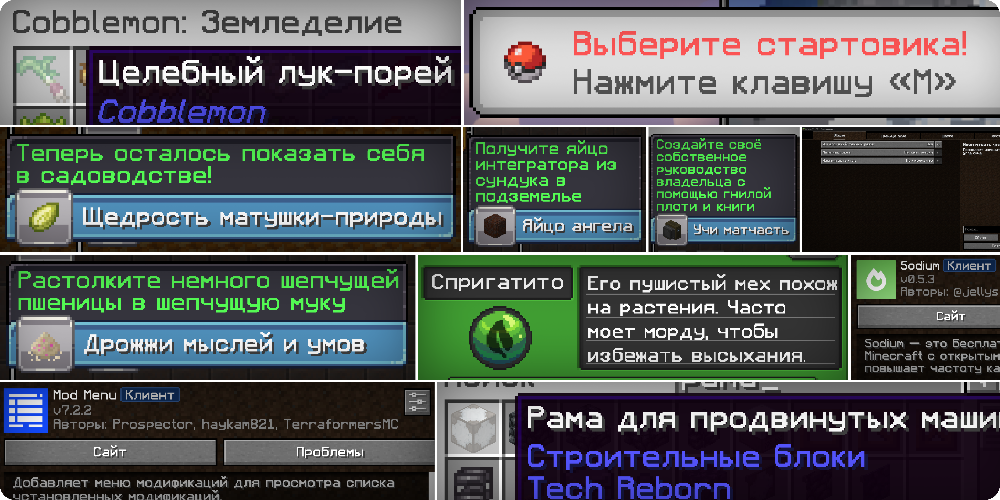
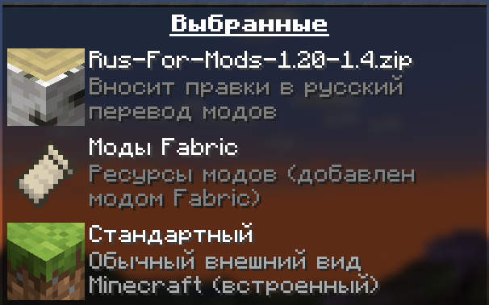

# Русский перевод модификаций Minecraft от Дефлекты

    
     
     
    
    
    
     
     
    <!---->

Меня не устраивало то, какой обычно бывает перевод на русский в модах для Minecraft, и поэтому я решил сам улучшить их переводы, а также добавить русский перевод туда, где его нет.

Это набор ресурсов, разрабатываемый для версий Minecraft от 1.16.x до 1.20.x, затрагивающий перевод модов, сделанных под загрузчики Forge, Fabric, Quilt и NeoForge.

Помимо русского языка в наборе планируются переводы и на остальные языки, используемые в России, Беларуси и Украине. Например, в определённых версиях этого набора уже включены переводы некоторых модов на татарский и белорусский языки.

## ⚙️ Затронутые моды

Раскрыть список

 

* `1.7—1.21` — версии игры
* ⬛ — мода нет на эту версию
* 🟥 — полного перевода пока нет, но возможно есть частичный
* ✅ — перевод готов

| Мод | [1.7](https://docs.google.com/spreadsheets/d/1RvozWJU5MYusAiJiMfODWA1t-bj2jhIj0FZCY5UU28k/edit?usp=sharing) | [1.12](https://docs.google.com/spreadsheets/d/1RvozWJU5MYusAiJiMfODWA1t-bj2jhIj0FZCY5UU28k/edit?usp=sharing) | [1.16]( https://docs.google.com/spreadsheets/d/1RvozWJU5MYusAiJiMfODWA1t-bj2jhIj0FZCY5UU28k/edit?usp=sharing) | [1.17]( https://docs.google.com/spreadsheets/d/1RvozWJU5MYusAiJiMfODWA1t-bj2jhIj0FZCY5UU28k/edit?usp=sharing) | [1.18](/1.18/assets/README.md) | [1.19]( https://docs.google.com/spreadsheets/d/1RvozWJU5MYusAiJiMfODWA1t-bj2jhIj0FZCY5UU28k/edit?usp=sharing) | [1.20]( https://docs.google.com/spreadsheets/d/1RvozWJU5MYusAiJiMfODWA1t-bj2jhIj0FZCY5UU28k/edit?usp=sharing) | [1.21]( https://docs.google.com/spreadsheets/d/1RvozWJU5MYusAiJiMfODWA1t-bj2jhIj0FZCY5UU28k/edit?usp=sharing) |
| --- | --- | --- | --- | --- | --- | --- | --- | --- |
| [[ETF] Entity Texture Features](https://modrinth.com/mod/entitytexturefeatures) | ⬛ | ⬛ | 🟥 | 🟥 | 🟥 | 🟥 | 🟥 | 🟥 |
| [[TFB] Anthro Origins](https://modrinth.com/mod/tfb_anthro_origins) | ⬛ | ⬛ | 🟥 | 🟥 | 🟥 | 🟥 | ⬛ | ⬛ |
| [A Few More Plushies](https://modrinth.com/mod/afmp) | ⬛ | ⬛ | ⬛ | ⬛ | ⬛ | 🟥 | ✅ Рус. | ⬛ |
| [Absent by Design](https://modrinth.com/mod/absent-by-design) | ⬛ | 🟥 | 🟥 | 🟥 | 🟥 | 🟥 | ✅ Рус. | ⬛ |
| [Accessories](https://modrinth.com/mod/accessories) | 🟥 | 🟥 | 🟥 | 🟥 | 🟥 | 🟥 | 🟥 | ✅ Рус. |
| [Actually Useful Smithing Table](https://modrinth.com/mod/actually-useful-smithing-table) | 🟥 | 🟥 | ✅ Рус. | ✅ Рус. | ✅ Рус. | ✅ Рус. | 🟥 | 🟥 |
| [Additional Additions](https://modrinth.com/mod/addadd) | ⬛ | ⬛ | ⬛ | 🟥 | ✅ Рус. ✅ Тат. | ✅ Рус. ✅ Тат. | ✅ Рус. | 🟥 |
| [Adorn](https://modrinth.com/mod/adorn) | ⬛ | 🟥 | 🟥 | 🟥 | 🟥 | 🟥 | 🟥 | 🟥 |
| [Advancement Frames](https://modrinth.com/mod/advancement-frames) | 🟥 | 🟥 | ✅ Рус. | 🟥 | ✅ Рус. | ✅ Рус. | ✅ Рус. | 🟥 |
| [Adventure Backpack](https://www.curseforge.com/minecraft/mc-mods/adventure-backpack) | ✅ Рус. | 🟥 | 🟥 | 🟥 | 🟥 | 🟥 | 🟥 | 🟥 |
| [Aerlune RPG](https://www.curseforge.com/minecraft/mc-mods/aerlune-rpg) | 🟥 | 🟥 | 🟥 | 🟥 | 🟥 | 🟥 | 🟥 | 🟥 |
| [AgriCraft](https://modrinth.com/mod/agricraft) | 🟥 | 🟥 | 🟥 | 🟥 | 🟥 | 🟥 | 🟥 | 🟥 |
| [AIOT Botania](https://www.curseforge.com/minecraft/mc-mods/aiot-botania)| ⬛ | ✅ Рус. | ✅ Рус. | ⬛ | ✅ Рус. | ✅ Рус. | ✅ Рус. | ⬛ |
| [Alex's Caves Delight](https://modrinth.com/mod/alexs-caves-delight) | 🟥 | 🟥 | 🟥 | 🟥 | 🟥 | 🟥 | ✅ Рус. | 🟥 |
| [Alex's Caves](https://modrinth.com/mod/alexs-caves) | ⬛ | 🟥 | ⬛ | ⬛ | ⬛ | ⬛ | 🟥 | ⬛ |
| [Alex's Delight](https://www.curseforge.com/minecraft/mc-mods/alexs-delight) | 🟥 | 🟥 | ✅ Рус. | 🟥 | ✅ Рус. | ✅ Рус. | ✅ Рус. | 🟥 |
| [Alex's Delights](https://www.curseforge.com/minecraft/mc-mods/alexs-delights) | 🟥 | 🟥 | ✅ Рус. | ✅ Рус. | ✅ Рус. | 🟥 | 🟥 | 🟥 |
| [Alex's Mobs](https://modrinth.com/mod/alexs-mobs) | ⬛ | 🟥 | 🟥 | 🟥 | 🟥 | 🟥 | 🟥 | ⬛ |
| [All the Fan Made Discs](https://modrinth.com/mod/all-the-fan-made-discs) | ⬛ | 🟥 | ⬛ | 🟥 | 🟥 | 🟥 | ✅ Рус. | ⬛ |
| [All the Ores](https://www.curseforge.com/minecraft/mc-mods/ato) | ⬛ | ⬛ | 🟥 | 🟥 | 🟥 | 🟥 | 🟥 | ✅ Рус. |
| [Ancient Warfare 2](https://www.curseforge.com/minecraft/mc-mods/ancient-warfare-2) | 🟥 | 🟥 | 🟥 | 🟥 | 🟥 | 🟥 | 🟥 | 🟥 |
| [Ancient Warfare Legacy](https://www.curseforge.com/minecraft/mc-mods/ancient-warfare-legacy) | 🟥 | 🟥 | ✅ Рус. | 🟥 | 🟥 | 🟥 | 🟥 | 🟥 |
| [Animatica](https://modrinth.com/mod/animatica) | ⬛ | 🟥 | ⬛ | 🟥 | 🟥 | 🟥 | ✅ Рус. | 🟥 |
| [AnimaticaReforged](https://modrinth.com/mod/animaticareforged) | ⬛ | 🟥 | 🟥 | ⬛ | 🟥 | 🟥 | 🟥 | ⬛ |
| [AppleSkin](https://modrinth.com/mod/appleskin) | ⬛ | 🟥 | ✅ Рус. ✅ Бел. | ✅ Рус. ✅ Бел. | ✅ Рус. ✅ Бел. | ✅ Рус. ✅ Бел. | ✅ Рус. ✅ Бел. | 🟥 |
| [Applied Energistics 2 Wireless Terminals](https://modrinth.com/mod/applied-energistics-2-wireless-terminals) | 🟥 | 🟥 | 🟥 | 🟥 | 🟥 | 🟥 | 🟥 | ✅ Рус. |
| [Applied Energistics 2](https://modrinth.com/mod/ae2) | 🟥 | 🟥 | 🟥 | ✅ Рус. | 🟥 | 🟥 | 🟥 | 🟥 |
| [Applied Mekanistics](https://www.curseforge.com/minecraft/mc-mods/applied-mekanistics) | ⬛ | ⬛ | ⬛ | ⬛ | 🟥 | 🟥 | 🟥 | 🟥 |
| [Aqua Creepers!](https://www.curseforge.com/minecraft/mc-mods/aqua-creepers) | ✅ Рус. | ✅ Рус. | ⬛ | ⬛ | ✅ Рус. | ⬛ | ✅ Рус. | ⬛ |
| [ArmorStatusHUD](https://www.curseforge.com/minecraft/mc-mods/armorstatushud) | ✅ Рус. | 🟥 | ⬛ | ⬛ | ⬛ | ⬛ | ⬛ | ⬛ |
| [Aroma1997Core](https://www.curseforge.com/minecraft/mc-mods/aroma1997core) | ✅ Рус. | ✅ Рус. | 🟥 | 🟥 | 🟥 | 🟥 | 🟥 | 🟥 |
| [AromaBackup](https://www.curseforge.com/minecraft/mc-mods/aromabackup) | ✅ Рус. | 🟥 | 🟥 | 🟥 | 🟥 | 🟥 | 🟥 | 🟥 |
| [Ars Nouveau](https://modrinth.com/mod/ars-nouveau) | ⬛ | 🟥 | ⬛ | ⬛ | 🟥 | 🟥 | 🟥 | ⬛ |
| [Artifacts](https://modrinth.com/mod/artifacts) | ⬛ | 🟥 | ⬛ | ⬛ | ⬛ | 🟥 | 🟥 | ⬛ |
| [Auto Workstations](https://modrinth.com/mod/auto-workstations) | ⬛ | 🟥 | ⬛ | ⬛ | 🟥 | 🟥 | 🟥 | 🟥 |
| [Automatic Tool Swap](https://www.curseforge.com/minecraft/mc-mods/automatic-tool-swap) | ⬛ | 🟥 | 🟥 | ✅ Рус. | 🟥 | 🟥 | 🟥 | 🟥 |
| [Back Up Beds](https://modrinth.com/mod/back-up-beds) | ⬛ | 🟥 | ⬛ | ⬛ | ⬛ | ⬛ | ✅ Рус. | ⬛
| [Backported Wolves](https://modrinth.com/mod/backported-wolves) | ⬛ | 🟥 | ⬛ | ⬛ | 🟥 | 🟥 | 🟥 | ⬛
| [Bad Wither No Cookie - Reloaded](https://modrinth.com/mod/bad-wither-no-cookie) | ⬛ | 🟥 | 🟥 | 🟥 | 🟥 | 🟥 | ✅ Рус. | ⬛
| [Bartering Station](https://modrinth.com/mod/bartering-station) | 🟥 | 🟥 | 🟥 | 🟥 | 🟥 | ✅ Рус. | ✅ Рус. | ✅ Рус. |
| [Baubles 2](https://modrinth.com/mod/baubles-2) | ⬛ | 🟥 | ⬛ | ⬛ | ⬛ | ⬛ | ⬛ | ✅ Рус. |
| [Better Biome Blend](https://modrinth.com/mod/better-biome-blend) | ⬛ | 🟥 | 🟥 | ✅ Рус. | 🟥 | 🟥 | ⬛ | ⬛
| [Better Dungeons](https://www.curseforge.com/minecraft/mc-mods/better-dungeons) | 🟥 | ⬛ | ⬛ | ⬛ | ⬛ | ⬛ | ⬛ | ⬛ |
| [Better Loading Screen GTNH](https://github.com/GTNewHorizons/BetterLoadingScreen) | ✅ Рус. | 🟥 | 🟥 | 🟥 | 🟥 | 🟥 | 🟥 | 🟥 |
| [Better Mods Button](https://www.curseforge.com/minecraft/mc-mods/better-mods-button) | ⬛ | 🟥 | 🟥 | ✅ Рус. | 🟥 | 🟥 | 🟥 | 🟥
| [BetterEnd](https://modrinth.com/mod/betterend) | ⬛ | ⬛ | ⬛ | ⬛ | ⬛ | 🟥 | 🟥 | 🟥 |
| [Bocchium](https://www.curseforge.com/minecraft/mc-mods/bocchium) | ⬛ | 🟥 | 🟥 | ⬛ | 🟥 | 🟥 | ✅ Рус. | ⬛ |
| [Bookshelf](https://modrinth.com/mod/bookshelf-lib) | 🟥 | 🟥 | ✅ Рус. | 🟥 | 🟥 | 🟥 | 🟥 | ⬛ |
| [Botania](https://modrinth.com/mod/botania) | 🟥 | 🟥 | 🟥 | 🟥 | ⬛ | 🟥 | 🟥 | ⬛ |
| [Burnt](https://modrinth.com/mod/burnt) | ⬛ | 🟥 | ⬛ | ⬛ | ⬛ | ⬛ | ✅ Рус. | ⬛ |
| [Canvas Renderer](https://modrinth.com/mod/canvas) | 🟥 | 🟥 | ⬛ | ⬛ | 🟥 | 🟥 | 🟥 | ⬛ |
| [Catalogue](https://www.curseforge.com/minecraft/mc-mods/catalogue) | ⬛ | 🟥 | ✅ Рус. | ✅ Рус. | 🟥 | 🟥 | 🟥 | 🟥
| [Cave Dweller Evolved](https://modrinth.com/mod/cave-dweller-evolved) | ⬛ | 🟥 | ⬛ | ⬛ | 🟥 | ✅ Рус. | ✅ Рус. | ⬛ |
| [Cave Dweller Fabric](https://modrinth.com/mod/cave-dweller-fabric) | ⬛ | 🟥 | ⬛ | ⬛ | ⬛ | ✅ Рус. | ✅ Рус. | ⬛
| [CC: Tweaked](https://modrinth.com/mod/cc-tweaked) | ⬛ | 🟥 | 🟥 | 🟥 | 🟥 | 🟥 | 🟥 | 🟥 |
| [Chat Heads](https://modrinth.com/mod/chat-heads) | ⬛ | 🟥 | ✅ Рус. ✅ Бел. ✅ Тат. | 🟥 | 🟥 | 🟥 | ✅ Рус. | 🟥 |
| [Chrysalis](https://modrinth.com/mod/chrysalis) | ⬛ | 🟥 | ⬛ | ⬛ | ⬛ | 🟥 | 🟥 | ⬛ |
| [Classic Steam Dynamo](https://www.curseforge.com/minecraft/mc-mods/steam-dynamo) | ⬛ | 🟥 | ⬛ | ⬛ | ⬛ | ⬛ | ✅ Рус. | ⬛ |
| [Clear Despawn](https://modrinth.com/mod/cleardespawn) | ⬛ | 🟥 | 🟥 | 🟥 | 🟥 | 🟥 | ✅ Рус. | ⬛ |
| [Cloth Config API](https://modrinth.com/mod/cloth-config) | 🟥 | 🟥 | 🟥 | ✅ Рус. | 🟥 | 🟥 | 🟥 | ✅ Рус. |
| [Cobblemon](https://modrinth.com/mod/cobblemon) | ⬛ | ⬛ | ⬛ | ⬛ | ⬛ | ⬛ | 🟥 | ⬛ |
| [Combat Maids](https://modrinth.com/mod/combat-maids) | 🟥 | 🟥 | 🟥 | 🟥 | 🟥 | 🟥 | 🟥 | 🟥 |
| [ComputerCraft](https://modrinth.com/mod/computercraft)  | 🟥 | 🟥 | ⬛ | ⬛ | ⬛ | ⬛ | ⬛ | ⬛ |
| [Concrete Extras](https://modrinth.com/mod/concrete-extras) | ⬛ | ⬛ | ⬛ | ⬛ | ⬛ | ⬛ | 🟥 | 🟥 |
| [Configured](https://www.curseforge.com/minecraft/mc-mods/configured) | 🟥 | 🟥 | 🟥 | 🟥 | ✅ Рус. | 🟥 | 🟥 | 🟥 |
| [Continuity](https://modrinth.com/mod/continuity) | 🟥 | 🟥 | 🟥 | 🟥 | 🟥 | 🟥 | 🟥 | 🟥
| [Controlify](https://modrinth.com/mod/controlify) | ⬛ | ⬛ | ⬛ | ⬛ | ⬛ | 🟥 | 🟥 | 🟥 |
| [Controlling](https://modrinth.com/mod/controlling) | 🟥 | 🟥 | 🟥 | 🟥 | 🟥 | 🟥 | ✅ Рус. | 🟥 |
| [Cosmetic Armor Reworked](https://www.curseforge.com/minecraft/mc-mods/cosmetic-armor-reworked) | 🟥 | 🟥 | 🟥 | 🟥 | ✅ Рус. | 🟥 | 🟥 | 🟥 |
| [Cosmetic Armor](https://modrinth.com/mod/cosmetic-armor) | 🟥 | 🟥 | 🟥 | 🟥 | 🟥 | 🟥 | 🟥 | ✅ Рус. |
| [CraftPresence](https://modrinth.com/mod/craftpresence) | 🟥 | 🟥 | 🟥 | 🟥 | 🟥 | 🟥 | 🟥 | 🟥 |
| [CreRaces](https://modrinth.com/mod/creraces) | 🟥 | 🟥 | 🟥 | 🟥 | 🟥 | 🟥 | 🟥 | 🟥 |
| [Curios API](https://modrinth.com/mod/curios) | 🟥 | 🟥 | 🟥 | 🟥 | 🟥 | 🟥 | 🟥 | 🟥 |
| [Dark Mode Everywhere](https://modrinth.com/mod/dark-mode-everywhere) | 🟥 | 🟥 | 🟥 | 🟥 | 🟥 | 🟥 | 🟥 | ✅ Рус. ✅ Бел. |
| [Decocraft](https://modrinth.com/mod/decocraft) | 🟥 | 🟥 | 🟥 | 🟥 | 🟥 | 🟥 | 🟥 | 🟥
| [Delightful Creators](https://www.curseforge.com/minecraft/mc-mods/delightful-creators-fabric) | 🟥 | 🟥 | 🟥 | 🟥 | 🟥 | 🟥 | 🟥 | 🟥 |
| [Ding](https://modrinth.com/mod/ding) | 🟥 | 🟥 | 🟥 | 🟥 | 🟥 | 🟥 | 🟥 | ✅ Рус. |
| [Domestication Innovation](https://www.curseforge.com/minecraft/mc-mods/domestication-innovation) | 🟥 | 🟥 | 🟥 | 🟥 | 🟥 | ✅ Рус. | 🟥 | 🟥 |
| [Duckling](https://modrinth.com/mod/duckling) | ⬛ | ⬛ | ⬛ | ⬛ | ✅ Рус. | ✅ Рус. | ✅ Рус. | ✅ Рус. |
| [Dynamic Crosshair](https://modrinth.com/mod/dynamiccrosshair) | 🟥 | 🟥 | 🟥 | 🟥 | 🟥 | 🟥 | 🟥 | 🟥 |
| [Dynamic FPS](https://modrinth.com/mod/dynamic-fps) | 🟥 | 🟥 | 🟥 | 🟥 | 🟥 | 🟥 | ✅ Рус. | ✅ Рус. |
| [e4mc](https://modrinth.com/mod/e4mc) | 🟥 | 🟥 | 🟥 | 🟥 | ✅ Рус. ✅ Укр. | ✅ Рус. ✅ Укр. | ✅ Рус. ✅ Укр. | ✅ Рус. ✅ Укр. |
| [Embeddium++](https://modrinth.com/mod/embeddiumplus) | 🟥 | 🟥 | 🟥 | 🟥 | 🟥 | 🟥 | 🟥 | 🟥
| [EmbeddiumUI](https://modrinth.com/mod/embyui) | 🟥 | 🟥 | 🟥 | 🟥 | 🟥 | 🟥 | ✅ Рус. | 🟥 |
| [EMI](https://modrinth.com/mod/emi) | 🟥 | 🟥 | 🟥 | 🟥 | 🟥 | 🟥 | 🟥 | 🟥
| [Enchantment Descriptions](https://www.curseforge.com/minecraft/mc-mods/enchantment-descriptions) | 🟥 | 🟥 | 🟥 | 🟥 | ✅ Рус. | 🟥 | 🟥 | 🟥 |
| [Endless Music](https://modrinth.com/mod/endless-music) | 🟥 | 🟥 | 🟥 | 🟥 | 🟥 | 🟥 | 🟥 | ✅ Рус. |
| [Enhanced Attack Indicator](https://modrinth.com/mod/enhanced-attack-indicator) | 🟥 | 🟥 | 🟥 | 🟥 | 🟥 | 🟥 | 🟥 | ✅ Рус. |
| [Enigmatic Legacy](https://modrinth.com/mod/enigmatic-legacy) | 🟥 | 🟥 | 🟥 | 🟥 | 🟥 | 🟥 | 🟥 | 🟥 |
| [Entity Culling](https://modrinth.com/mod/entityculling) | 🟥 | 🟥 | 🟥 | 🟥 | 🟥 | 🟥 | 🟥 | ✅ Рус. |
| [Fabric Convention Tags](https://github.com/FabricMC/fabric) | 🟥 | 🟥 | 🟥 | 🟥 | 🟥 | 🟥 | 🟥 | 🟥 |
| [Fabric Registry Sync](https://github.com/FabricMC/fabric) | 🟥 | 🟥 | 🟥 | 🟥 | 🟥 | 🟥 | 🟥 | ✅ Рус. |
| [Fabric Resource Loader](https://github.com/FabricMC/fabric) | 🟥 | 🟥 | 🟥 | 🟥 | 🟥 | 🟥 | 🟥 | ✅ Рус. |
| [Fabric](https://github.com/FabricMC/fabric) | 🟥 | 🟥 | ✅ Рус. | ✅ Рус. | ✅ Рус. | ✅ Рус. | ✅ Рус. | ✅ Рус. |
| [FabricSkyBoxes Interop](https://modrinth.com/mod/fabricskyboxes-interop) | 🟥 | 🟥 | 🟥 | 🟥 | 🟥 | 🟥 | 🟥 | ✅ Рус. |
| [FabricSkyBoxes](https://modrinth.com/mod/fabricskyboxes) | 🟥 | 🟥 | 🟥 | 🟥 | 🟥 | 🟥 | 🟥 | ✅ Рус. ✅ Тат. |
| [FastWorkbench](https://www.curseforge.com/minecraft/mc-mods/fastworkbench) | 🟥 | 🟥 | 🟥 | 🟥 | 🟥 | 🟥 | 🟥 | 🟥 |
| [Fish's Undead Rising](https://www.curseforge.com/minecraft/mc-mods/fishs-undead-rising) | ⬛ | 🟥 | 🟥 | ⬛ | ⬛ | ⬛ | ⬛ | ⬛
| [FTB Library](https://www.curseforge.com/minecraft/mc-mods/ftb-library-forge) | 🟥 | 🟥 | 🟥 | 🟥 | 🟥 | 🟥 | 🟥 | ✅ Рус. |
| [FTB Quests](https://www.curseforge.com/minecraft/mc-mods/ftb-quests-forge) | 🟥 | 🟥 | 🟥 | 🟥 | 🟥 | 🟥 | 🟥 | 🟥
| [Full Brightness Toggle](https://modrinth.com/mod/full-brightness-toggle) | 🟥 | 🟥 | 🟥 | 🟥 | 🟥 | 🟥 | 🟥 | ✅ Рус. |
| [Functional Thermal Drawers](https://www.curseforge.com/minecraft/mc-mods/functional-thermal-drawers) | 🟥 | 🟥 | 🟥 | 🟥 | 🟥 | 🟥 | 🟥 | ✅ Рус. |
| [FurBandits](https://www.curseforge.com/minecraft/mc-mods/furbandits) | 🟥 | 🟥 | 🟥 | 🟥 | 🟥 | 🟥 | 🟥 | 🟥 |
| [Geckolib](https://modrinth.com/mod/geckolib) | 🟥 | 🟥 | 🟥 | 🟥 | 🟥 | 🟥 | 🟥 | 🟥 |
| [Greate (дополнение к GregTechCEu Modern)](https://modrinth.com/mod/greate) | 🟥 | 🟥 | 🟥 | 🟥 | 🟥 | 🟥 | 🟥 | 🟥
| [Gregicality Rocketry](https://modrinth.com/mod/gcyr) | 🟥 | 🟥 | 🟥 | 🟥 | 🟥 | 🟥 | 🟥 | 🟥
| [Gregified Integrations](https://modrinth.com/mod/gregified-integrations) | 🟥 | 🟥 | 🟥 | 🟥 | 🟥 | 🟥 | 🟥 | 🟥
| [GregTechCEu Modern](https://modrinth.com/mod/gregtechceu-modern) | 🟥 | 🟥 | 🟥 | 🟥 | 🟥 | 🟥 | 🟥 | 🟥
| [Guardians Galore](https://modrinth.com/mod/guardians-galore-fabric) | 🟥 | 🟥 | 🟥 | 🟥 | 🟥 | 🟥 | 🟥 | ✅ Рус. |
| [Happy Pride Moth!](https://modrinth.com/mod/pride-moths) | 🟥 | 🟥 | 🟥 | 🟥 | 🟥 | 🟥 | 🟥 | ✅ Рус. |
| [Hephaestus (Tinkers' Construct)](https://modrinth.com/mod/hephaestus) | 🟥 | 🟥 | 🟥 | 🟥 | 🟥 | 🟥 | 🟥 | 🟥
| [Hex Casting](https://modrinth.com/mod/hex-casting) | 🟥 | 🟥 | 🟥 | 🟥 | 🟥 | 🟥 | 🟥 | 🟥
| [Hey Wiki](https://modrinth.com/mod/hey-wiki) | 🟥 | 🟥 | 🟥 | 🟥 | 🟥 | 🟥 | 🟥 | 🟥
| [Ice and Fire](https://modrinth.com/mod/ice-and-fire-dragons) | 🟥 | 🟥 | 🟥 | 🟥 | 🟥 | 🟥 | 🟥 | 🟥
| [Iceopolis](https://www.curseforge.com/minecraft/mc-mods/iceopolis) | 🟥 | 🟥 | 🟥 | ⬛ | ⬛ | ⬛ | ✅ Рус. | ⬛ |
| [Idwtialsimmoedm](https://modrinth.com/mod/idwtialsimmoedm) | 🟥 | 🟥 | 🟥 | 🟥 | 🟥 | ✅ Рус. | 🟥 | ✅ Рус. |
| [Immersive Petroleum](https://www.curseforge.com/minecraft/mc-mods/immersive-petroleum) | 🟥 | 🟥 | 🟥 | 🟥 | ⬛ | 🟥 | 🟥 | ⬛ |
| [Industrial Craft](https://www.curseforge.com/minecraft/mc-mods/industrial-craft) | 🟥 | 🟥 | ⬛ | ⬛ | ⬛ | ⬛ | ⬛ | ⬛
| [InWitched](https://modrinth.com/mod/inwitched) | 🟥 | 🟥 | 🟥 | 🟥 | 🟥 | 🟥 | 🟥 | 🟥 |
| [Iris Shaders](https://modrinth.com/mod/iris) | 🟥 | 🟥 | 🟥 | 🟥 | 🟥 | 🟥 | 🟥 | ✅ Рус. |
| [Iron's Spells 'n Spellbooks](https://modrinth.com/mod/irons-spells-n-spellbooks) | 🟥 | 🟥 | 🟥 | 🟥 | 🟥 | 🟥 | 🟥 | 🟥
| [Jade](https://modrinth.com/mod/jade) | 🟥 | 🟥 | 🟥 | 🟥 | 🟥 | 🟥 | 🟥 | 🟥 |
| [JAOPCAGT (дополнение к GregTechCEu Modern)](https://modrinth.com/mod/jaopcagt) | 🟥 | 🟥 | 🟥 | 🟥 | 🟥 | 🟥 | 🟥 | 🟥
| [Just Enough Advancements](https://www.curseforge.com/minecraft/mc-mods/jea) | 🟥 | 🟥 | 🟥 | 🟥 | 🟥 | 🟥 | 🟥 | 🟥 |
| [Just Enough Items](https://modrinth.com/mod/jei) | 🟥 | 🟥 | 🟥 | 🟥 | 🟥 | 🟥 | 🟥 | 🟥 |
| [Just Enough Resources](https://modrinth.com/mod/just-enough-resources-jer) | 🟥 | 🟥 | 🟥 | 🟥 | 🟥 | 🟥 | 🟥 | 🟥 |
| [Kawaii Dishes](https://modrinth.com/mod/kawaii-dishes) | 🟥 | 🟥 | 🟥 | 🟥 | 🟥 | 🟥 | 🟥 | 🟥 |
| [Kit Tunes](https://modrinth.com/mod/kit-tunes) | 🟥 | 🟥 | 🟥 | 🟥 | 🟥 | 🟥 | 🟥 | 🟥 |
| [LambDynamicLights](https://modrinth.com/mod/lambdynamiclights) | 🟥 | 🟥 | 🟥 | 🟥 | 🟥 | 🟥 | 🟥 | 🟥 |
| [Language Reload](https://modrinth.com/mod/language-reload) | 🟥 | 🟥 | 🟥 | 🟥 | 🟥 | 🟥 | 🟥 | 🟥 |
| [Legacy4J](https://modrinth.com/mod/legacy4j) | 🟥 | 🟥 | 🟥 | 🟥 | 🟥 | 🟥 | 🟥 | 🟥 |
| [LibJF](https://modrinth.com/mod/libjf) | 🟥 | 🟥 | 🟥 | 🟥 | 🟥 | 🟥 | 🟥 | ✅ Рус. |
| [Litematica](https://litematica.org) | 🟥 | 🟥 | 🟥 | 🟥 | 🟥 | 🟥 | ✅ Рус. | 🟥 |
| [Look](https://modrinth.com/mod/look) | 🟥 | 🟥 | 🟥 | 🟥 | 🟥 | 🟥 | 🟥 | ✅ Рус. |
| [Lootr](https://modrinth.com/mod/lootr) | 🟥 | 🟥 | 🟥 | 🟥 | 🟥 | 🟥 | 🟥 | 🟥
| [Loqui](https://loqui.imb11.dev) | 🟥 | 🟥 | 🟥 | ⬛ | ⬛ | ⬛ | ✅ Рус. | ✅ Рус. |
| [Lucky Block](https://www.curseforge.com/minecraft/mc-mods/lucky-block) | 🟥 | 🟥 | 🟥 | 🟥 | 🟥 | ✅ Рус. ✅ Тат. | 🟥 | 🟥 |
| [Luna](https://modrinth.com/mod/luna) | 🟥 | 🟥 | 🟥 | 🟥 | 🟥 | 🟥 | 🟥 | 🟥 |
| [Lycanthropy](https://modrinth.com/mod/lycanthropy) | 🟥 | 🟥 | 🟥 | 🟥 | 🟥 | 🟥 | 🟥 | ✅ Рус. |
| [Macaw's Bridges](https://modrinth.com/mod/macaws-bridges) | 🟥 | 🟥 | ✅ Рус. | ✅ Рус. | ✅ Рус. | ✅ Рус. | ✅ Рус. | ✅ Рус. |
| [Macaw's Doors](https://modrinth.com/mod/macaws-doors) | 🟥 | 🟥 | ✅ Рус. | ✅ Рус. | ✅ Рус. | ✅ Рус. | ✅ Рус. | ✅ Рус. |
| [Macaw's Fences and Walls](https://modrinth.com/mod/macaws-fences-and-walls) | 🟥 | 🟥 | ✅ Рус. | ✅ Рус. | ✅ Рус. | ✅ Рус. | ✅ Рус. | ✅ Рус. |
| [Macaw's Furniture](https://modrinth.com/mod/macaws-furniture) | 🟥 | 🟥 | 🟥 | 🟥 | 🟥 | 🟥 | 🟥 | 🟥
| [Macaw's Holidays](https://modrinth.com/mod/macaws-holidays) | 🟥 | 🟥 | 🟥 | 🟥 | 🟥 | 🟥 | 🟥 | 🟥
| [Macaw's Lights and Lamps](https://modrinth.com/mod/macaws-lights-and-lamps) | 🟥 | 🟥 | 🟥 | 🟥 | 🟥 | 🟥 | 🟥 | 🟥
| [Macaw's Paintings](https://modrinth.com/mod/macaws-paintings) | 🟥 | 🟥 | 🟥 | 🟥 | 🟥 | 🟥 | 🟥 | 🟥
| [Macaw's Paths and Pavings](https://modrinth.com/mod/macaws-paths-and-pavings) | 🟥 | 🟥 | 🟥 | 🟥 | 🟥 | 🟥 | 🟥 | 🟥
| [Macaw's Roofs](https://modrinth.com/mod/macaws-roofs) | 🟥 | 🟥 | 🟥 | 🟥 | 🟥 | 🟥 | 🟥 | 🟥
| [Macaw's Trapdoors](https://modrinth.com/mod/macaws-trapdoors) | 🟥 | 🟥 | 🟥 | 🟥 | 🟥 | 🟥 | 🟥 | 🟥
| [Macaw's Windows](https://modrinth.com/mod/macaws-windows) | 🟥 | 🟥 | 🟥 | 🟥 | 🟥 | 🟥 | 🟥 | 🟥
| [Mahou Tsukai](https://modrinth.com/mod/mahou-tsukai) | 🟥 | 🟥 | 🟥 | 🟥 | 🟥 | 🟥 | 🟥 | 🟥
| [Make Bubbles Pop](https://modrinth.com/mod/make_bubbles_pop) | 🟥 | 🟥 | 🟥 | 🟥 | 🟥 | 🟥 | 🟥 | ✅ Рус. |
| [Mana and Artifice](https://modrinth.com/mod/mana-and-artifice) | 🟥 | 🟥 | 🟥 | 🟥 | 🟥 | 🟥 | 🟥 | 🟥 |
| [MarbleGate's Exotic Enchantment: Flowing Agony](https://modrinth.com/mod/flowing-agony) | 🟥 | 🟥 | 🟥 | 🟥 | 🟥 | 🟥 | 🟥 | 🟥 |
| [Mica](https://modrinth.com/mod/mica) | 🟥 | 🟥 | 🟥 | 🟥 | 🟥 | 🟥 | 🟥 | ✅ Рус. |
| [MidnightControls](https://modrinth.com/mod/midnightcontrols) | 🟥 | 🟥 | 🟥 | 🟥 | 🟥 | 🟥 | 🟥 | 🟥
| [MidnightLib](https://modrinth.com/mod/midnightlib) | 🟥 | 🟥 | 🟥 | 🟥 | 🟥 | 🟥 | 🟥 | 🟥
| [MineColonies for ComputerCraft](https://www.curseforge.com/minecraft/mc-mods/minecolonies-for-computercraft) | 🟥 | 🟥 | 🟥 | 🟥 | ✅ Рус. | ✅ Рус. | ✅ Рус. | ⬛ |
| [Minecraft Forge](https://files.minecraftforge.net/net/minecraftforge/forge) | 🟥 | 🟥 | 🟥 | 🟥 | 🟥 | 🟥 | ✅ Рус. | 🟥 |
| [Mod Menu](https://modrinth.com/mod/modmenu) | 🟥 | 🟥 | 🟥 | 🟥 | ✅ Рус. | ✅ Рус. | ✅ Рус. | ✅ Рус. |
| [ModernFix](https://modrinth.com/mod/modernfix) | 🟥 | 🟥 | 🟥 | 🟥 | 🟥 | 🟥 | 🟥 | 🟥
| [Monazite (дополнение к GregTechCEu Modern)](https://modrinth.com/mod/monazite) | 🟥 | 🟥 | 🟥 | 🟥 | 🟥 | 🟥 | 🟥 | 🟥 |
| [More Music Discs](https://modrinth.com/mod/more-music-discs) | 🟥 | 🟥 | 🟥 | 🟥 | 🟥 | 🟥 | 🟥 | ✅ Рус. |
| [MrCrayfish's Furniture Mod (Legacy)](https://www.curseforge.com/minecraft/mc-mods/mrcrayfish-furniture-mod) | 🟥 | 🟥 | 🟥 | 🟥 | 🟥 | 🟥 | 🟥 | 🟥 |
| [MrCrayfish's Furniture Mod: Refurbished](https://www.curseforge.com/minecraft/mc-mods/refurbished-furniture) | ⬛ | ⬛ | ⬛ | ⬛ | ⬛ | ⬛ | 🟥 | ⬛ |
| [Nature's Aura](https://modrinth.com/mod/natures-aura) | 🟥 | 🟥 | 🟥 | 🟥 | 🟥 | 🟥 | 🟥 | 🟥
| [NEEPMeat](https://modrinth.com/mod/neepmeat) | 🟥 | 🟥 | 🟥 | 🟥 | 🟥 | 🟥 | 🟥 | 🟥 |
| [Neighborly](https://www.curseforge.com/minecraft/mc-mods/neighborly) | 🟥 | 🟥 | 🟥 | 🟥 | 🟥 | 🟥 | 🟥 | 🟥 |
| [NeoForge](https://neoforged.net) | 🟥 | 🟥 | 🟥 | 🟥 | 🟥 | 🟥 | 🟥 | 🟥 |
| [Nevermore!](https://modrinth.com/datapack/nevermore) | 🟥 | 🟥 | 🟥 | 🟥 | 🟥 | 🟥 | 🟥 | 🟥 |
| [ParCool!](https://modrinth.com/mod/parcool) | 🟥 | 🟥 | 🟥 | 🟥 | 🟥 | ✅ Рус. | 🟥 | 🟥 |
| [Patchouli](https://modrinth.com/mod/patchouli) | 🟥 | 🟥 | 🟥 | 🟥 | 🟥 | 🟥 | ✅ Рус. | 🟥 |
| [Pigsteel](https://modrinth.com/mod/pigsteel-fabric) | 🟥 | 🟥 | 🟥 | 🟥 | 🟥 | 🟥 | 🟥 | ✅ Рус. |
| [Pokeblocks](https://modrinth.com/mod/pokeblocks) | 🟥 | 🟥 | 🟥 | 🟥 | 🟥 | 🟥 | 🟥 | 🟥 |
| [Powah!](https://modrinth.com/mod/powah) | 🟥 | 🟥 | 🟥 | 🟥 | 🟥 | 🟥 | 🟥 | 🟥 |
| [Raised](https://modrinth.com/mod/raised) | 🟥 | 🟥 | 🟥 | 🟥 | 🟥 | 🟥 | 🟥 | 🟥 |
| [Rats](https://modrinth.com/mod/rats) | 🟥 | 🟥 | 🟥 | 🟥 | 🟥 | 🟥 | 🟥 | 🟥 |
| [Recrafted Creatures](https://www.curseforge.com/minecraft/mc-mods/recrafted-creatures)| 🟥 | 🟥 | 🟥 | 🟥 | 🟥 | 🟥 | 🟥 | 🟥 |
| [Red Pandas!](https://modrinth.com/mod/red-pandas-wueffi) | ⬛ | 🟥 | ⬛ | ⬛ | ⬛ | ⬛ | 🟥 | ⬛ |
| [Redstone Clock](https://www.curseforge.com/minecraft/mc-mods/redstone-clock) | 🟥 | 🟥 | 🟥 | 🟥 | 🟥 | 🟥 | 🟥 | ✅ Рус.
| [Reese's Sodium Options](https://modrinth.com/mod/reeses-sodium-options) | 🟥 | 🟥 | 🟥 | 🟥 | 🟥 | 🟥 | 🟥 | 🟥
| [Regions Unexplored](https://modrinth.com/mod/regions-unexplored) | 🟥 | 🟥 | 🟥 | 🟥 | 🟥 | 🟥 | 🟥 | 🟥 |
| [ReplayMod](https://modrinth.com/mod/replaymod) | 🟥 | 🟥 | 🟥 | 🟥 | 🟥 | 🟥 | 🟥 | 🟥 |
| [Respackopts](https://modrinth.com/mod/respackopts) | 🟥 | 🟥 | 🟥 | 🟥 | 🟥 | 🟥 | ✅ Рус. | 🟥 |
| [Ribbits](https://modrinth.com/mod/ribbits) | ⬛ | ⬛ | ⬛ | ⬛ | ⬛ | ⬛ | ✅ Рус. | ⬛ |
| [Right Proper Lighting Engine](https://modrinth.com/mod/rple) | 🟥 | 🟥 | ⬛ | ⬛ | ⬛ | ⬛ | ⬛ | ⬛ |
| [Rotten Creatures](https://modrinth.com/mod/rottencreatures) | 🟥 | 🟥 | 🟥 | 🟥 | 🟥 | ✅ Рус. | ✅ Рус. | 🟥
| [Roughly Enough Items](https://modrinth.com/mod/rei) | 🟥 | 🟥 | 🟥 | 🟥 | 🟥 | 🟥 | 🟥 | 🟥
| [Ryoamium](https://modrinth.com/mod/ryoamium) | 🟥 | 🟥 | 🟥 | 🟥 | 🟥 | 🟥 | ✅ Рус. | 🟥
| [Sawmill](https://modrinth.com/mod/universal-sawmill) | 🟥 | 🟥 | 🟥 | 🟥 | 🟥 | ✅ Рус. | ✅ Рус. | ✅ Рус. |
| [SCP Lockdown Extras](https://www.curseforge.com/minecraft/mc-mods/scp-lockdown-extras) | ⬛ | ✅ Рус. | ⬛ | ⬛ | ⬛ | ⬛ | ⬛ | ⬛ |
| [SecurityCraft](https://modrinth.com/mod/security-craft) | 🟥 | 🟥 | 🟥 | 🟥 | 🟥 | 🟥 | 🟥 | 🟥 |
| [Serene Seasons Fix](https://www.curseforge.com/minecraft/mc-mods/serene-seasons-fix) | ⬛ | ⬛ | ✅ Рус. | ✅ Рус. | ✅ Рус. | ✅ Рус. | ✅ Рус. | ⬛ |
| [Serene Seasons](https://modrinth.com/mod/serene-seasons) | 🟥 | 🟥 | 🟥 | 🟥 | 🟥 | 🟥 | 🟥 | 🟥 |
| [Showcase Item](https://modrinth.com/mod/showcase-item) | 🟥 | 🟥 | 🟥 | 🟥 | 🟥 | 🟥 | 🟥 | ✅ Рус. |
| [Simple Corinthium](https://www.curseforge.com/minecraft/mc-mods/simple-corinthium) | 🟥 | 🟥 | 🟥 | 🟥 | 🟥 | ✅ Рус. | ✅ Рус. | 🟥 |
| [Simple Weapons for Better Combat](https://www.curseforge.com/minecraft/mc-mods/simple-weapons-for-better-combat) | 🟥 | 🟥 | 🟥 | 🟥 | 🟥 | ✅ Рус. | ✅ Рус. | 🟥 |
| [SimplyStatus](https://modrinth.com/mod/simplystatus) | 🟥 | 🟥 | 🟥 | 🟥 | 🟥 | 🟥 | ✅ Рус. | 🟥 |
| [Smooth Boot (Fabric)](https://modrinth.com/mod/smoothboot-fabric) | 🟥 | 🟥 | 🟥 | 🟥 | 🟥 | ✅ Рус. | 🟥 | 🟥 |
| [Smooth Boot (Reloaded)](https://modrinth.com/mod/smooth-boot-reloaded) | 🟥 | 🟥 | 🟥 | 🟥 | 🟥 | ✅ Рус. | 🟥 | 🟥 |
| [Snad](https://www.curseforge.com/minecraft/mc-mods/snad) | 🟥 | 🟥 | 🟥 | 🟥 | 🟥 | 🟥 | ✅ Рус. | 🟥 |
| [Sodium Extra](https://modrinth.com/mod/sodium-extra) | 🟥 | 🟥 | 🟥 | 🟥 | 🟥 | 🟥 | 🟥 | 🟥 |
| [Sodium](https://modrinth.com/mod/sodium) | 🟥 | 🟥 | 🟥 | 🟥 | 🟥 | ✅ Рус. | ✅ Рус. | ✅ Рус. |
| [Sound Physics Remastered](https://modrinth.com/mod/sound-physics-remastered) | 🟥 | 🟥 | 🟥 | 🟥 | 🟥 | 🟥 | 🟥 | 🟥 |
| [SpaceworldMons [Cobblemon]](https://modrinth.com/datapack/spaceworldmons-cobblemon) | ⬛ | 🟥 | ⬛ | ⬛ | ⬛ | ⬛ | ✅ Рус. | ⬛ |
| [Spawners+](https://modrinth.com/mod/spawners_plus) | 🟥 | 🟥 | 🟥 | 🟥 | 🟥 | 🟥 | ✅ Рус. | 🟥 |
| [StaffDerpsMod](https://modrinth.com/mod/staffderpsmod) | ⬛ | 🟥 | ⬛ | 🟥 | 🟥 | 🟥 | 🟥 | ⬛ |
| [Subnautica Flow](https://modrinth.com/mod/subnautica-flow) | 🟥 | 🟥 | 🟥 | 🟥 | 🟥 | 🟥 | 🟥 | 🟥 |
| [Sulfur Based Weapon Development](https://modrinth.com/mod/sbwd) | 🟥 | 🟥 | 🟥 | ⬛ | ⬛ | ⬛ | ✅ Рус. | ⬛ |
| [Tails](https://www.curseforge.com/minecraft/mc-mods/tails) | ✅ Рус. | 🟥 | 🟥 | 🟥 | 🟥 | 🟥 | 🟥 | 🟥 |
| [Tech Reborn](https://www.curseforge.com/minecraft/mc-mods/techreborn) | 🟥 | 🟥 | 🟥 | 🟥 | 🟥 | 🟥 | 🟥 | 🟥 |
| [Text Placeholder API](https://modrinth.com/mod/placeholder-api) | 🟥 | 🟥 | 🟥 | 🟥 | 🟥 | 🟥 | 🟥 | ✅ Рус. |
| [The Aether II](https://modrinth.com/mod/aether-ii) | ✅ Рус. | 🟥 | 🟥 | 🟥 | 🟥 | 🟥 | 🟥 | 🟥 |
| [The Aether](https://modrinth.com/mod/aether) | 🟥 | 🟥 | 🟥 | 🟥 | 🟥 | 🟥 | 🟥 | 🟥 |
| [The Dark Dweller](https://modrinth.com/mod/the-dark-dweller) | 🟥 | 🟥 | 🟥 | 🟥 | 🟥 | ✅ Рус. | 🟥 | 🟥 |
| [The Essentials mod](https://modrinth.com/mod/the-essentials-mod)| 🟥 | 🟥 | 🟥 | 🟥 | 🟥 | 🟥 | 🟥 | 🟥 |
| [The Fellow Furries Mod](https://modrinth.com/mod/fellowfurriesmod) | 🟥 | 🟥 | 🟥 | 🟥 | 🟥 | 🟥 | ✅ Рус. | 🟥 |
| [The Twilight Forest](https://www.curseforge.com/minecraft/mc-mods/the-twilight-forest) | 🟥 | 🟥 | 🟥 | 🟥 | 🟥 | ✅ Рус. | ✅ Рус. | 🟥 |
| [Thermal Systeams: Monifactory Edition](https://github.com/ThePansmith/Monifactory/blob/main/mods/systeams-1.20.1-1.7.1.jar) | 🟥 | 🟥 | 🟥 | 🟥 | 🟥 | 🟥 | ✅ Рус. | 🟥 |
| [Thigh highs etc.](https://modrinth.com/mod/thigh-highs-etc) | 🟥 | 🟥 | 🟥 | 🟥 | 🟥 | 🟥 | ✅ Рус. | 🟥 |
| [Tinkers' Construct](https://modrinth.com/mod/tinkers-construct) | 🟥 | 🟥 | 🟥 | ⬛ | 🟥 | 🟥 | ⬛ | ⬛ |
| [Tips](https://modrinth.com/mod/tips) | 🟥 | 🟥 | 🟥 | 🟥 | 🟥 | 🟥 | 🟥 | 🟥 |
| [Title Fixer](https://modrinth.com/mod/title-fixer) | 🟥 | 🟥 | 🟥 | 🟥 | 🟥 | 🟥 | ✅ Рус. | 🟥 |
| [Toast Control](https://www.curseforge.com/minecraft/mc-mods/toast-control) | 🟥 | 🟥 | 🟥 | 🟥 | 🟥 | 🟥 | ✅ Рус. | 🟥 |
| [Tool Belt](https://www.curseforge.com/minecraft/mc-mods/tool-belt) | 🟥 | 🟥 | 🟥 | 🟥 | 🟥 | 🟥 | ✅ Рус. | 🟥 |
| [Tool Stats](https://modrinth.com/mod/tool-stats) | ⬛ | ⬛ | 🟥 | 🟥 | 🟥 | 🟥 | ✅ Рус. | ⬛ |
| [ToroHealth Damage Indicators (Updated)](https://modrinth.com/mod/torohealth-damage-indicators-updated) | ⬛ | ⬛ | ⬛ | ⬛ | ⬛ | 🟥 | 🟥 | ⬛ |
| [ToroHealth Damage Indicators](https://www.curseforge.com/minecraft/mc-mods/torohealth-damage-indicators) | ⬛ | 🟥 | 🟥 | 🟥 | 🟥 | 🟥 | ⬛ | ⬛ |
| [Touhou Little Maid](https://modrinth.com/mod/touhou-little-maid) | ⬛ | ⬛ | 🟥 | ⬛ | 🟥 | 🟥 | 🟥 | ⬛ |
| [Trading Post](https://modrinth.com/mod/trading-post) | 🟥 | 🟥 | ✅ Рус. | ✅ Рус. | ✅ Рус. | ✅ Рус. | ✅ Рус. | ✅ Рус. |
| [Trofers](https://modrinth.com/mod/trofers) | ⬛ | ⬛ | ⬛ | ⬛ | 🟥 | 🟥 | ✅ Рус. | 🟥 |
| [VoxelMap-Updated](https://modrinth.com/mod/voxelmap-updated) | ⬛ | ⬛ | ⬛ | 🟥 | 🟥 | 🟥 | 🟥 | 🟥 |
| [VoxelMap](https://www.curseforge.com/minecraft/mc-mods/voxelmap) | 🟥 | 🟥 | 🟥 | 🟥 | ⬛ | ⬛ | ⬛ | ⬛ |
| [WATERFrAMES](https://modrinth.com/mod/waterframes)| ⬛ | ⬛ | ⬛ | ⬛ | 🟥 | 🟥 | 🟥 | 🟥 |
| [Xaero's Minimap](https://modrinth.com/mod/xaeros-minimap) | 🟥 | 🟥 | 🟥 | 🟥 | 🟥 | 🟥 | 🟥 | 🟥 |
| [Xaero's World Map](https://modrinth.com/mod/xaeros-world-map) | 🟥 | 🟥 | 🟥 | 🟥 | 🟥 | 🟥 | 🟥 | 🟥 |
| [Xenon](https://modrinth.com/mod/xenon-forge) | ⬛ | ⬛ | ⬛ | ⬛ | ⬛ | ⬛ | ✅ Рус. | ⬛ |

Список будет пополняться.

## 🏭 Затронутые сборки

Помимо основного набора, наш проект включает переводы некоторых сборок модов для Minecraft. Мы перевели файлы, которые не являются частью отдельных модов, а относятся непосредственно к сборкам: заголовок окна игры, кнопки меню, квесты и другие элементы интерфейса.

Установка переводов для этих сборок осуществляется ручной заменой соответствующих файлов сборки на версии из нашего репозитория. Вы можете ознакомиться с ними и скачать по следующим ссылкам:

| Сборка | Русское название | Для версии сборки | Статус перевода |
| - | - | - | - |
| [Monifactory](https://github.com/RushanM/Minecraft-Mods-Russian-Translation/tree/alpha/%D0%A1%D0%B1%D0%BE%D1%80%D0%BA%D0%B8/Monifactory) | *Монифактори*, *Всезавод* | Бета 0.8.1 | **ПЕРЕВОД В ПРОЦЕССЕ**: переведён интерфейс и несколько квестов |
| [The Ferret Business](https://github.com/RushanM/Minecraft-Mods-Russian-Translation/tree/alpha/%D0%A1%D0%B1%D0%BE%D1%80%D0%BA%D0%B8/The%20Ferret%20Business) | *Хорьковый бизнес* | Альфа 0.4.2 | **ПЕРЕВОД В ПРОЦЕССЕ**: переведено главное меню и голос |
| [All of Fabric 6](https://github.com/RushanM/Minecraft-Mods-Russian-Translation/tree/alpha/%D0%A1%D0%B1%D0%BE%D1%80%D0%BA%D0%B8/All%20of%20Fabric%206) | *Всё для Fabric 6* | ? | **ПЕРЕВОД В ПРОЦЕССЕ**: переведено несколько квестов |
| [GregTech: New Horizons](https://github.com/RushanM/Minecraft-Mods-Russian-Translation/tree/alpha/%D0%A1%D0%B1%D0%BE%D1%80%D0%BA%D0%B8/GT%20New%20Horizons) | *GregTech: новые горизонты* | 2.6.1 | **ПЕРЕВОД В ПРОЦЕССЕ**: переведено несколько квестов и кнопки главного меню |
| [Better MC 4](https://github.com/RushanM/Minecraft-Mods-Russian-Translation/tree/alpha/%D0%A1%D0%B1%D0%BE%D1%80%D0%BA%D0%B8/Better%20MC%204) | *Улучшенный Minecraft 4* | 32.5 | **ПЕРЕВОД В ПРОЦЕССЕ**: переведены все квесты, требуется вычитка и перевод оставшегося |

Все эти переводы находятся на ранней стадии разработки, но вы уже можете попробовать их в действии.

## 🚀 Установка

Скачать набор ресурсов можно [здесь в GitHub со списка выпусков](https://github.com/RushanM/Minecraft-Mods-Russian-Translation/releases) или со следующих сайтов:

<a href="https://www.curseforge.com/minecraft/texture-packs/mods-ru">
    

</a>

> Если не можете решиться, откуда скачивать, скачивайте с Modrinth. Сайт — конфетка!

### 🏷️ Версии

Набор ресурсов следует своеобразной, но знакомой системе версий.

С выпуском каждой версии число в номере версии увеличивается, но это число не разделено точками (раньше было разделено, но теперь нет). То есть, первый выпуск будет иметь номер 1, а второй выпуск будет иметь номер 2, а не 1.0 и 1.1. Но если к выпуску 2 вышло исправительное обновление, оно будет иметь номер 2.1.

К этому числу также иногда приписываются буквы: A и B. Они означают соответственно «альфа» и «бета». Альфа-версия содержит всевозможные переводы проекта, но хуже качеством, чем бета-версия или релиз. Бета-версия содержит только те переводы, что были завершены полностью (иногда в них случайно могут попадать незавершённые переводы, но это лишь недоглядки автора! Сообщайте о них, пожалуйста). Также есть релизная версия, которая не имеет никакой буквы. То есть, любой номер версии без букв считается релизным. В такой версии уже не должно быть места ошибкам и недоглядкам, но в большинстве случаев получается наоборот (просто мне нужны тестировщики).

Перед буквой (если она есть) и числом приписывается версия игры.

Примеры:

* 1.21-B1 — это бета-версия №1 для Minecraft 1.21—1.21.1
* 1.20-5 — это релизная версия №5 для Minecraft 1.20—1.20.6

### 📋 Порядок

Чтобы набор имел возможность изменять перевод модов, он должен стоять выше набора ресурсов модов. Например, у Fabric он называется «Моды Fabric» (Fabric Mods).

    

### 🔁 Моды-расширения

#### 📃 [Better Resource Pack Sorting](https://modrinth.com/mod/better-resource-pack-sorting) (Forge, Fabric, Quilt)

Если вы установите [Better Resource Pack Sorting](https://modrinth.com/mod/better-resource-pack-sorting), русификатор обзаведётся русским названием в меню наборов ресурсов.

#### 🔄 [DynamicPack](https://modrinth.com/mod/dynamicpack) (Fabric)

Если вы установите [DynamicPack](https://modrinth.com/mod/dynamicpack), русификатор всегда будет обновляться до последней версии и вам не нужно будет следить за тем, когда выйдет новая.

## 📛 Способствовали разработке

Раскрыть список

 

Участники проекта на Гитхабе

<small>(плашка сделана с помощью [contrib.rocks](https://contrib.rocks))</small>

* [**Дефлекта**](https://github.com/RushanM): большая часть переводов
* [**1the_same_cat1**](https://www.curseforge.com/members/1the_same_cat1): предложил переводы модов
* * [Simple Corinthium](https://www.curseforge.com/minecraft/mc-mods/simple-corinthium)
* * [Simple Weapons for Better Combat](https://www.curseforge.com/minecraft/mc-mods/simple-weapons-for-better-combat)
* * [Rotten Creatures](https://modrinth.com/mod/rottencreatures)
* [**Inqurity**](https://github.com/Inqurity): участвовал в русском и украинском переводах модов
* * [Idwtialsimmoedm](https://modrinth.com/mod/idwtialsimmoedm)
* * [e4mc](https://modrinth.com/mod/e4mc)
* [**REXE**](https://github.com/RedmanEXE): перевёл на белорусский моды
* * [Chat Heads](https://modrinth.com/mod/chat-heads)
* * [AppleSkin](https://modrinth.com/mod/appleskin)
* * [Dark Mode Everywhere](https://modrinth.com/mod/dark-mode-everywhere)
* [**ggleb2**](https://github.com/ggleb2) и [**Western01**](https://github.com/marisathewitch): сделали полезные указания
* [**aBIank**](https://github.com/SillyAsriel): участвовал в принятии решений, перевёл некоторые квесты Monifactory
* [**TheAnaxMan**](https://github.com/TheAnaxMan): предложил переводы
* * [All the Fabric 6](https://github.com/RushanM/Minecraft-Mods-Russian-Translation/tree/alpha/%D0%A1%D0%B1%D0%BE%D1%80%D0%BA%D0%B8/All%20of%20Fabric%206)
* * [All the Ores](https://www.curseforge.com/minecraft/mc-mods/ato)
* * [Allthemodium](https://www.curseforge.com/minecraft/mc-mods/allthemodium)
* * [Artifacts](https://modrinth.com/mod/artifacts)
* * [Auto Workstations](https://modrinth.com/mod/auto-workstations)
* [**cutiegin**](https://github.com/cutiegin): предложила переводы модов
* * [Decocraft](https://modrinth.com/mod/decocraft)
* * [Macaw's Bridges](https://modrinth.com/mod/macaws-bridges)
* * [Macaw's Doors](https://modrinth.com/mod/macaws-doors)
* * [Macaw's Fences and Walls](https://modrinth.com/mod/macaws-fences-and-walls)
* * [Macaw's Furniture](https://modrinth.com/mod/macaws-furniture)
* * [Macaw's Holidays](https://modrinth.com/mod/macaws-holidays)
* * [Macaw's Lights and Lamps](https://modrinth.com/mod/macaws-lights-and-lamps)
* * [Macaw's Paintings](https://modrinth.com/mod/macaws-paintings)
* * [Macaw's Paths and Pavings](https://modrinth.com/mod/macaws-paths-and-pavings)
* * [Macaw's Roofs](https://modrinth.com/mod/macaws-roofs)
* * [Macaw's Trapdoors](https://modrinth.com/mod/macaws-trapdoors)
* * [Macaw's Windows](https://modrinth.com/mod/macaws-windows)
* * [MrCrayfish's Furniture Mod (Legacy)](https://www.curseforge.com/minecraft/mc-mods/mrcrayfish-furniture-mod)
* * [MrCrayfish's Furniture Mod: Refurbished](https://www.curseforge.com/minecraft/mc-mods/refurbished-furniture)
* * [SecurityCraft](https://modrinth.com/mod/security-craft)
* [**ySh**](https://github.com/INe6dy): предложил переводы модов
* * [Chipped](https://modrinth.com/mod/chipped)
* * [Malum](https://modrinth.com/mod/malum)
* [**xaxilin**](https://steamcommunity.com/id/xaxilin/): предложил переводы
* * [Bartering Station](https://modrinth.com/mod/bartering-station)
* * [Better MC 4](https://www.curseforge.com/minecraft/modpacks/better-mc-forge-bmc4)
* * [BetterEnd](https://modrinth.com/mod/betterend)
* * [BisectHosting Server Integration Menu](https://modrinth.com/mod/bisect-mod)
* * [Bookshelf](https://modrinth.com/mod/bookshelf-lib)
* * [Configured](https://www.curseforge.com/minecraft/mc-mods/configured)
* * [Curios API](https://modrinth.com/mod/curios)
* * [FTB Library](https://www.curseforge.com/minecraft/mc-mods/ftb-library-forge)
* * [Geckolib](https://modrinth.com/mod/geckolib)
* * [Jade](https://modrinth.com/mod/jade)
* * [L_Ender's Cataclysm](https://modrinth.com/mod/l_enders-cataclysm)
* * [Luna](https://www.curseforge.com/minecraft/mc-mods/luna)
* * [Sawmill](https://modrinth.com/mod/universal-sawmill)
* * [Serene Seasons Fix](https://www.curseforge.com/minecraft/mc-mods/serene-seasons-fix)
* * [Serene Seasons](https://modrinth.com/mod/serene-seasons)
* * [Spawners+](https://modrinth.com/mod/spawners_plus)
* * [Stalwart Dungeons](https://modrinth.com/mod/stalwart-dungeons)
* * [Tips](https://modrinth.com/mod/tips)
* * [Trading Post](https://modrinth.com/mod/trading-post)
* [**gri3229**](https://github.com/gri3229): предложил перевод мода [Industrial Foregoing](https://modrinth.com/mod/industrial-foregoing)
* [**Quinella**](https://steamcommunity.com/id/sasaikudasai221/): предложил перевод мода [FTB Quests](https://www.curseforge.com/minecraft/mc-mods/ftb-quests-fabric)
* [**Nord_Act**](https://github.com/NordAct): помогла с API
* [**devin**](https://github.com/intergrav): создал дизайн [кнопок](https://github.com/intergrav/devins-badges), используемых в этом readme-файле

## ✉️ Контакты

Есть личная просьба, предложение или любая другая причина обратиться лично ко мне? Вы можете написать мне в одной из этих сетей:

* ВКонтакте: **`deflecta`**
* Discord: **`deflecta`**
* Telegram: **`RMKHTDNV`**

## 💝 Материальная поддержка

Если моя работа нравится вам настолько, что вы готовы отправить мне деньги, можно сделать это по следующим ссылкам:

* [Boosty](https://boosty.to/rushanm)
* [VK Pay](https://vk.me/moneysend/deflecta)
* [Donation Alerts](https://www.donationalerts.com/r/deflecta)
* [ЮMoney](https://yoomoney.ru/to/410015215253910)

Буду благодарен за каждый рубль!