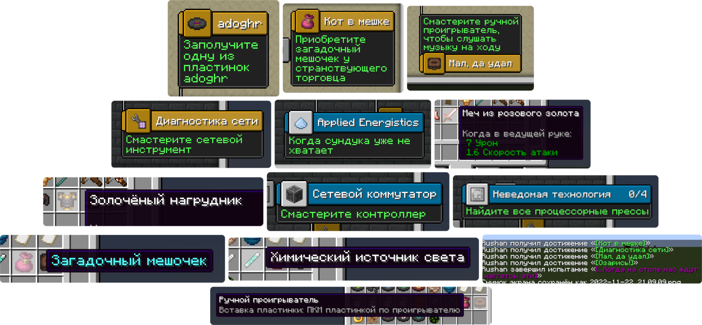

# Русский перевод модификаций для Minecraft Рушана Мухутдинова

    
     
     
    <!---->

Меня не устраивало то, какой обычно бывает перевод на русский в модах для Minecraft, и поэтому я решил сам улучшить их переводы, а также добавить русский перевод туда, где его нет.

Это набор ресурсов, разрабатываемый для версий 1.16, 1.17, 1.18, 1.19 и 1.20 Minecraft, затрагивающий перевод модов, сделанных под загрузчики Forge, Fabric и Quilt.

Помимо русского языка в наборе планируются переводы и на остальные языки, используемые в России, Белоруссии и Украине. Так, в некоторых из версий набора уже присутствуют переводы некоторых модификаций на татарский или украинский.

## ⚙️ Что затронуто

Раскрыть список

 

* `1.16`, `1.17`, `1.18`, `1.19`, `1.20` — версии игры;
* ❌ — перевода пока нет;
* ✅ — перевод готов.

| Модификация | 1.16 | 1.17 | 1.18 | 1.19 | 1.20 |
| - | - | - | - | - | - |
| [Forge](https://files.minecraftforge.net/net/minecraftforge/forge) | ✅ Русский | ❌ | ✅ Русский | ✅ Русский |
| [Smooth Boot (Fabric)](https://modrinth.com/mod/smoothboot-fabric) [Smooth Boot (Reloaded)](https://modrinth.com/mod/smooth-boot-reloaded) | ✅ Русский | ❌ | ❌ | ✅ Русский |
| [Configured](https://www.curseforge.com/minecraft/mc-mods/configured) | ✅ Русский | ✅ Русский | ❌ | ❌ |
| [Better Mods Button](https://modrinth.com/mod/better-mods-button) | ❌ | ✅ Русский | ❌ | ❌ |
| [Catalogue](https://www.curseforge.com/minecraft/mc-mods/catalogue) | ✅ Русский | ✅ Русский | ❌ | ❌ |
| [Mod Menu](https://modrinth.com/mod/modmenu) | ✅ Русский | ❌ | ✅ Русский | ✅ Русский |
| [Controlling](https://beta.curseforge.com/minecraft/mc-mods/controlling) | ✅ Русский | ❌ | ❌ | ✅ Русский |
| [Raised](https://modrinth.com/mod/raised) | ✅ Русский | ❌ | ❌ | ❌ |
| [Entity Culling](https://modrinth.com/mod/entityculling) | ✅ Русский | ❌ | ❌ | ❌ |
| [AppleSkin](https://modrinth.com/mod/appleskin) | ✅ Русский | ❌ | ❌ | ✅ Русский |
| [Better Biome Blend](https://modrinth.com/mod/better-biome-blend) | ✅ Русский | ✅ Русский | ❌ | ❌ |
| [Cosmetic Armor Reworked](https://www.curseforge.com/minecraft/mc-mods/cosmetic-armor-reworked) | ✅ Русский | ✅ Русский | ❌ | ❌ |
| [Automatic Tool Swap](https://www.curseforge.com/minecraft/mc-mods/automatic-tool-swap) | ✅ Русский | ✅ Русский | ❌ | ❌ |
| [Enchantment Descriptions](https://www.curseforge.com/minecraft/mc-mods/enchantment-descriptions) | ✅ Русский | ✅ Русский | ❌ | ❌ |
| [Chat Heads](https://modrinth.com/mod/chat-heads) | ✅ Русский | ❌ | ❌ | ❌ |
| [Lucky Block](https://www.curseforge.com/minecraft/mc-mods/lucky-block) | ✅ Русский ✅ Татарский | ❌ | ✅ Русский ✅ Татарский | ❌ |
| [Simple Corinthium](https://www.curseforge.com/minecraft/mc-mods/simple-corinthium) | ❌ | ❌ | ✅ Русский | ✅ Русский |
| [Simple Weapons for Better Combat](https://www.curseforge.com/minecraft/mc-mods/simple-weapons-for-better-combat) | ❌ | ❌ | ✅ Русский | ✅ Русский |
| [Additional Additions](https://modrinth.com/mod/addadd) | ❌ | ❌ | ✅ Русский ✅ Татарский | ❌ |
| [Rotten Creatures](https://modrinth.com/mod/rottencreatures) | ❌ | ❌ | ✅ Русский | ✅ Русский |
| [Domestication Innovation](https://www.curseforge.com/minecraft/mc-mods/domestication-innovation) | ❌ | ❌ | ✅ Русский | ❌ |
| [Applied Energistics 2](https://www.curseforge.com/minecraft/mc-mods/applied-energistics-2) | ❌ | ✅ Русский | ❌ | ❌ |
| [Immersive Petroleum](https://www.curseforge.com/minecraft/mc-mods/immersive-petroleum) | ✅ Русский | ❌ | ❌ | ❌ |
| [Idwtialsimmoedm](https://modrinth.com/mod/idwtialsimmoedm) | ❌ | ❌ | ✅ Русский | ✅ Русский |
| [e4mc](https://modrinth.com/mod/e4mc) | ❌ | ✅ Русский ✅ Украинский | ✅ Русский ✅ Украинский | ✅ Русский ✅ Украинский |

Список будет пополняться.

## 🚀 Установка

Скачать набор ресурсов можно [здесь в Гитхабе со списка выпусков](https://github.com/RushanM/Minecraft-Mods-Russian-Translation/releases) или со следующих сайтов:

> Если не можете решиться, откуда скачивать, скачивайте с Modrinth. Сайт — конфетка!

### Версии

Есть несколько версий набора и я приписываю к каждой версии свой номер. Например, «1.18-1.0» в названии набора расшифровывается как «редакция 1.0 для Minecraft 1.18». Я не могу разом перевести все модификации, и поэтому выпускаю набор этими самыми *редакциями* — пачками переводов для конкретных модификаций, которые я успел перевести. Первая редакция несёт номер 1.0, вторая 1.1, и каждая последующая редакция содержит переводы с прежней с изменениями или без, но обязательно с добавлением новых переводов.

<!-- ### Скачивание

Поместите скачанный архив в папку resourcepacks в папке .minecraft.

Включите набор в игре. -->

### Порядок

Чтобы набор имел возможность изменять перевод модификаций, он должен стоять выше набора ресурсов модификаций. Например, у Forge он называется Mod Resources.

    

## 📛 Авторы

* [**Рушан Мухутдинов**](https://github.com/RushanM): Делает этот набор ресурсов;
* [**1the_same_cat1**](https://www.curseforge.com/members/1the_same_cat1): Перевёл на русский модификации 
* * [*Simple Corinthium*](https://www.curseforge.com/minecraft/mc-mods/simple-corinthium), 
* * [*Simple Weapons for Better Combat*](https://www.curseforge.com/minecraft/mc-mods/simple-weapons-for-better-combat),
* * [*Rotten Creatures*](https://modrinth.com/mod/rottencreatures);
* [**Inqurity**](https://github.com/Inqurity): Перевёл на русский и украинский модификации
* * [*Idwtialsimmoedm*](https://modrinth.com/mod/idwtialsimmoedm), 
* * [*MidnightControls*](https://modrinth.com/mod/midnightcontrols), 
* * [*e4mc*](https://modrinth.com/mod/e4mc);
* [**UltraStorm**](https://github.com/intergrav): Создал дизайн [кнопок](https://github.com/intergrav/devins-badges), используемых в этом README.

## 💝 Материальная поддержка

Если моя работа нравится вам настолько, что вы готовы отправить мне деньги, можно сделать это по следующим ссылкам:

* ЮMoney: <https://yoomoney.ru/to/410015215253910>;
* QIWI: <https://qiwi.com/n/LAWEE042>;
* VK Pay: <https://vk.me/moneysend/rushandev>.

Буду благодарен за каждый рубль!
