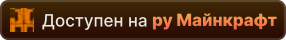

# Альфа-ветка русского перевода модификаций Minecraft Дефлекты

Добро пожаловать на ветку **`alpha`**. Эта среда предназначена для внесения изменений в проект. Все сторонние pull requests должны направляться сюда. Как переводы достигают определённого качества и завершённости, они попадают на ветку **`beta`**.

## Моды востребованные для перевода

Люди больше всего просят перевести эти моды, но они до сих пор не переведены из-за размеров перевода. Если вы нашли в себе силы и имеете достаточно опыта, можете взяться за них.

| Значок | Описание |
| :-: | :-: |
|  | <big>**[Mana and Artifice](https://modrinth.com/mod/zaRGNexp)**</big> 1.20 *8 просьб* |
|  | <big>**[Apotheosis](https://www.curseforge.com/minecraft/mc-mods/apotheosis)**</big> 1.20 *3 просьбы* |
|  | <big>**[The Abyss II - The Other Side](https://www.curseforge.com/minecraft/mc-mods/the-abyss-chapter-ii)**</big> 1.20 *3 просьбы* |
|  | <big>**[Feywild](https://www.curseforge.com/minecraft/mc-mods/feywild)**</big> 1.20 *3 просьбы* |

## Переводимые моды

Раскрыть список

 

| Версия игры | Статус перевода | Идентификатор | Мод | Версия мода |
| --- | --- | --- | --- | --- |
| 1.12 | Переведён | aiotbotania | AIOT Botania | 0.7.1 |
| 1.12 | Переведён | aqua_creepers | Aqua Creepers! | 1.2.3 |
| 1.12 | Переведён | aroma1997core | Aroma1997Core | 2.0.0.2 b167 |
| 1.12 | Переведён | scple | SCP Lockdown Extras | 1.0 |
| 1.12 | … | … | … | …
| 1.16 | Не готов | sodium | Sodium | 0.2 build.4 |
| 1.16 | Переведён | actuallyusefulsmithingtable | Actually Useful Smithing Table | 1.1 |
| 1.16 | Переведён | advancementframes | Advancement Frames | 1.0.5 |
| 1.16 | Переведён | alexsdelight | Alex's Delights | 1.0 |
| 1.16 | Переведён | amfd | Alex's Delight | 1.1.3 |
| 1.16 | Переведён | ancient_war | Ancient Warfare Legacy | 1.1 |
| 1.16 | Переведён | sereneseasonsfix | Serene Seasons Fix | 1.0.5 |
| 1.16 | Переведён | tradingpost | Trading Post | 1.0.2 |
| 1.16 | … | … | … | … |
| 1.17 | Не готов | sodium | Sodium | 0.3.4 build.13 |
| 1.17 | Переведён | actuallyusefulsmithingtable | Actually Useful Smithing Table | 2.1 |
| 1.17 | Переведён | alexsdelight | Alex's Delights | 1.1 |
| 1.17 | Переведён | sereneseasonsfix | Serene Seasons Fix | 1.0.5 |
| 1.17 | Переведён | tradingpost | Trading Post | 2.0 |
| 1.17 | … | … | … | … |
| 1.18 | Не готов | chipped | Chipped | 2.0.1 |
| 1.18 | Не готов | horror_element_mod | Horror Elements mod | 1.5.5 |
| 1.18 | Не готов | malum | Malum | 1.5.0.1 |
| 1.18 | Не готов | sodium | Sodium | 0.4.1 build.15 |
| 1.18 | Переведён | actuallyusefulsmithingtable | Actually Useful Smithing Table | 3.1 |
| 1.18 | Переведён | advancementframes | Advancement Frames | 1.1.1 |
| 1.18 | Переведён | alexsdelight | Alex's Delight | 1.3.3 |
| 1.18 | Переведён | alexsdelight | Alex's Delights | 1.2 |
| 1.18 | Переведён | sereneseasonsfix | Serene Seasons Fix | 1.0.6 |
| 1.18 | Переведён | tradingpost | Trading Post | 3.2 |
| 1.18 | … | … | … | … |
| 1.19 | Не готов | сataclysm | L_Ender's Cataclysm | 1.99.2 |
| 1.19 | Не готов | aether | The Aether | 1.4.2 |
| 1.19 | Не готов | horror_element_mod | Horror Elements mod | 1.5.9 |
| 1.19 | Переведён | actuallyusefulsmithingtable | Actually Useful Smithing Table | 4.1.1 |
| 1.19 | Переведён | advancementframes | Advancement Frames | 2.0 |
| 1.19 | Переведён | alexsdelight | Alex's Delight | 1.4.1 |
| 1.19 | Переведён | barteringstation | Bartering Station | 6.0 |
| 1.19 | Переведён | parcool | ParCool! | 3.2.1.2-R |
| 1.19 | Переведён | sawmill | Sawmill | 1.2 |
| 1.19 | Переведён | sereneseasonsfix | Serene Seasons Fix | 1.0.8 |
| 1.19 | Переведён | sodium | Sodium | 0.4.10 build.24 |
| 1.19 | Переведён | tradingpost | Trading Post | 6.0 |
| 1.19 | Переведён | twilightforest | The Twilight Forest | 4.2.1696 |
| 1.19 | … | … | … | … |
| 1.20 | Не готов | adorn | Adorn | 5.3 |
| 1.20 | Не готов | aether | The Aether | 1.4.2 |
| 1.20 | Не готов | betterend | BetterEnd | 4.30.1 |
| 1.20 | Не готов | biomesoplenty | Biomes O' Plenty | 18.3.0.11 |
| 1.20 | Не готов | cataclysm | L_Ender's Cataclysm | 1.99.5 |
| 1.20 | Не готов | combat_maid | Combat Maids | 1.0 Alpha |
| 1.20 | Не готов | create | Create | 0.5.1.h |
| 1.20 | Не готов | horror_element_mod | Horror Elements mod | 1.6 |
| 1.20 | Не готов | iceandfire | Ice and Fire | 2.1.13-beta-5 |
| 1.20 | Не готов | industrialforegoing | Industrial Foregoing | 3.5.19 |
| 1.20 | Не готов | luna | Luna | Beta Fabric 1.19-1.20 1.0.1 |
| 1.20 | Не готов | mna | Mana and Artifice | 3.0.0.24 |
| 1.20 | Не готов | sodium | Xenon | 0.3.19 |
| 1.20 | Переведён | absentbydesign | Absent by Design | 1.8 |
| 1.20 | Переведён | advancementframes | Advancement Frames | 2.2.7 |
| 1.20 | Переведён | alexscavesdelight | Alex's Caves Delight | 1.0.12 |
| 1.20 | Переведён | alexsdelight | Alex's Delight | 1.5 |
| 1.20 | Переведён | barteringstation | Bartering Station | 20.4.1 |
| 1.20 | Переведён | embeddium | Xenon | 0.3.19 |
| 1.20 | Переведён | minecraft | Xenon | 0.3.19 |
| 1.20 | Переведён | parcool | ParCool! | 3.2.1.2-R |
| 1.20 | Переведён | patchouli | Patchouli | 86 |
| 1.20 | Переведён | sawmill | Sawmill | 1.4.3 |
| 1.20 | Переведён | sereneseasonsfix | Serene Seasons Fix | 1.0.8 |
| 1.20 | Переведён | silentgear | Silent Gear | 3.6.6 |
| 1.20 | Переведён | sodium | Sodium | 0.5.11 |
| 1.20 | Переведён | spawnersplus | Spawners+ | 4.0 |
| 1.20 | Переведён | tradingpost | Trading Post | 20.4.2 |
| 1.20 | Переведён | trofers | Trofers | 5.0.2 |
| 1.20 | Переведён | xenon | Xenon | 0.3.19 |
| 1.20 | … | … | … | … |
| 1.21 | Не готов | betterend | BetterEnd | 21.0.11 |
| 1.21 | Не готов | combat_maid | Combat Maids | 1.0 Alpha |
| 1.21 | Не готов | fabric-convention-tags-v2 | Fabric Convention Tags | 08.06.2024 |
| 1.21 | Не готов | luna | Luna | Release Fabric 1.19-1.20 1.0.1 |
| 1.21 | Переведён | accessories | Accessories | 1.0.0 Beta 31 |
| 1.21 | Переведён | ae2wtlib | Applied Energistics 2 Wireless Terminals | 19.1.3-beta |
| 1.21 | Переведён | alltheores | All the Ores | 2.3.4-alpha |
| 1.21 | Переведён | barteringstation | Bartering Station | 21.0 |
| 1.21 | Переведён | fabric | Fabric | 08.06.2024 |
| 1.21 | Переведён | fabric-gamerule-test | Fabric | 08.06.2024 |
| 1.21 | Переведён | fabric-keybindings-v1-testmod | Fabric | 08.06.2024 |
| 1.21 | Переведён | fabric-networking-api-v1-testmod | Fabric | 08.06.2024 |
| 1.21 | Переведён | fabric-object-builder-api-v1-testmod | Fabric | 08.06.2024 |
| 1.21 | Переведён | fabric-particles-v1-testmod | Fabric | 08.06.2024 |
| 1.21 | Переведён | fabric-registry-sync-v0 | Fabric Registry Sync | 08.06.2024 |
| 1.21 | Переведён | fabric-resource-conditions-api-v1-testmod | Fabric | 08.06.2024 |
| 1.21 | Переведён | fabric-resource-loader-v0 | Fabric Resource Loader | 08.06.2024 |
| 1.21 | Переведён | fabric-resource-loader-v0-testmod | Fabric Resource Loader | 08.06.2024 |
| 1.21 | Переведён | fabric-resource-loader-v0-testmod-test1 | Fabric Resource Loader | 08.06.2024 |
| 1.21 | Переведён | fabric-screen-handler-api-v1-testmod | Fabric | 08.06.2024 |
| 1.21 | Переведён | ftblibrary | FTB Library | 2101.1.2 |
| 1.21 | Переведён | iris | Iris Shaders | 1.7.3 |
| 1.21 | Переведён | placeholder-api | Placeholder API | 2.4.1 |
| 1.21 | Переведён | sawmill | Sawmill | 1.5.3 |
| 1.21 | Переведён | sodium | Sodium | 0.6.0-beta.1 |
| 1.21 | Переведён | testmod | Fabric | 08.06.2024 |
| 1.21 | Переведён | tradingpost | Trading Post | 21.0.2 |
| 1.21 | … | … | … | … |

## Сборки

| Сборка | Русское название | Для версии сборки | Статус перевода |
| - | - | - | - |
| [Monifactory](https://github.com/RushanM/Minecraft-Mods-Russian-Translation/tree/alpha/%D0%A1%D0%B1%D0%BE%D1%80%D0%BA%D0%B8/Monifactory) | *Монифактори*, *Всезавод* | Бета 0.8.1 | **ПЕРЕВОД В ПРОЦЕССЕ**: переведён интерфейс и несколько квестов |
| [The Ferret Business](https://github.com/RushanM/Minecraft-Mods-Russian-Translation/tree/alpha/%D0%A1%D0%B1%D0%BE%D1%80%D0%BA%D0%B8/The%20Ferret%20Business) | *Хорьковый бизнес* | Альфа 0.4.2 | **ПЕРЕВОД В ПРОЦЕССЕ**: переведено главное меню и голос |
| [All of Fabric 6](https://github.com/RushanM/Minecraft-Mods-Russian-Translation/tree/alpha/%D0%A1%D0%B1%D0%BE%D1%80%D0%BA%D0%B8/All%20of%20Fabric%206) | *Всё для Fabric 6* | ? | **ПЕРЕВОД В ПРОЦЕССЕ**: переведено несколько квестов |
| [GregTech: New Horizons](https://github.com/RushanM/Minecraft-Mods-Russian-Translation/tree/alpha/%D0%A1%D0%B1%D0%BE%D1%80%D0%BA%D0%B8/GT%20New%20Horizons) | *GregTech: новые горизонты* | 2.6.1 | **ПЕРЕВОД В ПРОЦЕССЕ**: переведено несколько квестов и кнопки главного меню |
| [Better MC 4](https://github.com/RushanM/Minecraft-Mods-Russian-Translation/tree/alpha/%D0%A1%D0%B1%D0%BE%D1%80%D0%BA%D0%B8/Better%20MC%204) | *Улучшенный Minecraft 4* | 32.5 | **ПЕРЕВОД В ПРОЦЕССЕ**: переведены все квесты, требуется вычитка и перевод оставшегося |
| [All the Mods 9](https://github.com/RushanM/Minecraft-Mods-Russian-Translation/tree/alpha/%D0%A1%D0%B1%D0%BE%D1%80%D0%BA%D0%B8/All%20the%20Mods%209) | *Все моды 9* | ? | **ПЕРЕВОДА НЕТ** |

## Внешние ссылки

Список модов и сборок, затрагиваемых проектом, а также дополнений для его набора ресурсов, [**содержится на «Google Таблицах»**](https://docs.google.com/spreadsheets/d/1RvozWJU5MYusAiJiMfODWA1t-bj2jhIj0FZCY5UU28k/edit?usp=sharing).

<a href="https://www.curseforge.com/minecraft/texture-packs/mods-ru">
    

</a>

