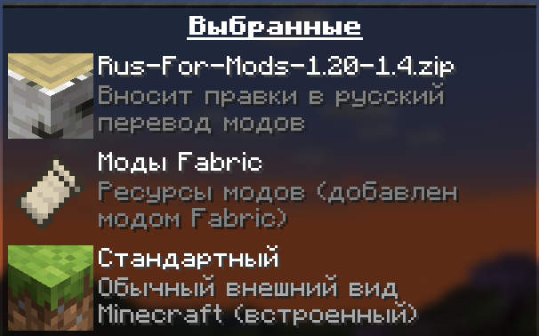

# Русский перевод модов Minecraft от Дефлекты

    
     
     
    
    
    
     
     
    <!---->

Меня не устраивало то, какой обычно бывает перевод на русский в модах для Minecraft, и поэтому я решил сам улучшить их переводы, а также добавить русский перевод туда, где его нет.

Это набор ресурсов, разрабатываемый для версий Minecraft от 1.16.x до 1.20.x, затрагивающий перевод модов, сделанных под загрузчики Forge, Fabric, Quilt и NeoForge.

Помимо русского языка в наборе планируются переводы и на остальные языки, используемые в России, Беларуси и Украине. Например, в определённых версиях этого набора уже включены переводы некоторых модов на татарский и украинский языки.

## ⚙️ Затронутые моды

Раскрыть список

 

* `1.7—1.21` — версии игры
* 🌌 — мода нет на эту версию
* ❌ — полного перевода пока нет, но возможно есть частичный
* ✅ — перевод готов

| Мод | [1.7](https://docs.google.com/spreadsheets/d/1RvozWJU5MYusAiJiMfODWA1t-bj2jhIj0FZCY5UU28k/edit?usp=sharing) | [1.16](https://docs.google.com/spreadsheets/d/1RvozWJU5MYusAiJiMfODWA1t-bj2jhIj0FZCY5UU28k/edit?usp=sharing) | [1.17](https://docs.google.com/spreadsheets/d/1RvozWJU5MYusAiJiMfODWA1t-bj2jhIj0FZCY5UU28k/edit?usp=sharing) | [1.18](/1.18/assets/README.md) | [1.19](https://docs.google.com/spreadsheets/d/1RvozWJU5MYusAiJiMfODWA1t-bj2jhIj0FZCY5UU28k/edit?usp=sharing) | [1.20](https://docs.google.com/spreadsheets/d/1RvozWJU5MYusAiJiMfODWA1t-bj2jhIj0FZCY5UU28k/edit?usp=sharing) | [1.21](https://docs.google.com/spreadsheets/d/1RvozWJU5MYusAiJiMfODWA1t-bj2jhIj0FZCY5UU28k/edit?usp=sharing) |
| - | - | - | - | - | - | - | - |
| [[ETF] Entity Texture Features](https://modrinth.com/mod/entitytexturefeatures) | 🌌 | ❌ | ❌ | ❌ | ❌ | ❌ | ❌ |
| [[TFB] Anthro Origins](https://modrinth.com/mod/tfb_anthro_origins) | 🌌 | ❌ | ❌ | ❌ | 🌌 | 🌌 | 🌌
| [A Few More Plushies](https://modrinth.com/mod/afmp) | 🌌 | ❌ | 🌌 | 🌌 | 🌌 | ✅ Рус. | ❌ |
| [Additional Additions](https://modrinth.com/mod/addadd) | 🌌 | ❌ | 🌌 | ❌ | ✅ Рус. ✅ Тат. | ✅ Рус. ✅ Тат. | ✅ Рус. |
| [Adorn](https://modrinth.com/mod/adorn) | 🌌 | ❌ | ❌ | ❌ | ❌ | ❌ |
| [All the Fan Made Discs](https://modrinth.com/mod/all-the-fan-made-discs) | ❌ | ❌ | 🌌 | 🌌 | ❌ | ❌ | ✅ Рус. |
| [Animatica](https://modrinth.com/mod/animatica) | ❌ | ❌ | 🌌 | ❌ | ❌ | ❌ | ✅ Рус. |
| [AppleSkin](https://modrinth.com/mod/appleskin) | ❌ | ✅ Рус. ✅ Бел. | ✅ Рус. ✅ Бел. | ✅ Рус. ✅ Бел. | ✅ Рус. ✅ Бел. | ✅ Рус. ✅ Бел. |
| [Applied Energistics 2](https://modrinth.com/mod/ae2) | ❌ | ❌ | ✅ Рус. | ❌ | ❌ | ❌ |
| [Ars Nouveau](https://modrinth.com/mod/ars-nouveau) | ❌ | ❌ | ❌ | ❌ | ❌ | ❌ |
| [Artifacts](https://modrinth.com/mod/artifacts) | ❌ | ❌ | ❌ | ❌ | ❌ | ❌ | ❌ |
| [Auto Workstations](https://modrinth.com/mod/auto-workstations) | ❌ | ❌ | ❌ | ❌ | ❌ | ❌ | ❌ |
| [Automatic Tool Swap](https://www.curseforge.com/minecraft/mc-mods/automatic-tool-swap) | ❌ | ❌ | ✅ Рус. | ❌ | ❌ | ❌ |
| [Back Up Beds](https://modrinth.com/mod/back-up-beds) | ❌ | ❌ | ❌ | ❌ | ❌ | ✅ Рус. |
| [Backported Wolves](https://modrinth.com/mod/backported-wolves) | ❌ | ❌ | ❌ | ❌ | ❌ | ❌ |
| [Bad Wither No Cookie - Reloaded](https://modrinth.com/mod/bad-wither-no-cookie) | ❌ | ❌ | ❌ | ❌ | ❌ | ✅ Рус. |
| [Baubles 2](https://modrinth.com/mod/baubles-2) | ❌ | ❌ | ❌ | ❌ | ❌ | ❌ | ❌ |
| [Better Biome Blend](https://modrinth.com/mod/better-biome-blend) | ❌ | ❌ | ✅ Рус. | ❌ | ❌ | 🌌 |
| [Better Mods Button](https://www.curseforge.com/minecraft/mc-mods/better-mods-button) | ❌ | ❌ | ✅ Рус. | ❌ | ❌ | ❌ |
| [Bocchium](https://www.curseforge.com/minecraft/mc-mods/bocchium) | ❌ | ❌ | ❌ | ❌ | ❌ | ✅ Рус. |
| [Bookshelf](https://modrinth.com/mod/bookshelf-lib) | ❌ | ✅ Рус. | ❌ | ❌ | ❌ | ❌ |
| [Botania](https://modrinth.com/mod/botania) | ❌ | ❌ | ❌ | ❌ | ❌ | ❌ |
| [Canvas Renderer](https://modrinth.com/mod/canvas) | ❌ | ❌ | 🌌 | ❌ | ❌ | ❌ | ❌ |
| [Catalogue](https://www.curseforge.com/minecraft/mc-mods/catalogue) | ❌ | ✅ Рус. | ✅ Рус. | ❌ | ❌ | ❌ |
| [Cave Dweller Evolved](https://modrinth.com/mod/cave-dweller-evolved) | ❌ | ❌ | ❌ | ❌ | ✅ Рус. | ✅ Рус. |
| [Cave Dweller](https://modrinth.com/mod/cave-dweller-fabric) | ❌ | ❌ | ❌ | ❌ | ✅ Рус. | ✅ Рус. |
| [CC: Tweaked](https://modrinth.com/mod/cc-tweaked) | ❌ | ❌ | ❌ | ❌ | ❌ | ❌ | ❌ |
| [Chat Heads](https://modrinth.com/mod/chat-heads) | ❌ | ✅ Рус. ✅ Бел. ✅ Тат. | ❌ | ❌ | ❌ | ✅ Рус. |
| [Chrysalis](https://modrinth.com/mod/chrysalis) | ❌ | ❌ | ❌ | ❌ | ❌ | ❌ | ❌ |
| [Classic Steam Dynamo](https://www.curseforge.com/minecraft/mc-mods/steam-dynamo) | ❌ | ❌ | ❌ | ❌ | ❌ | ✅ Рус. |
| [Clear Despawn](https://modrinth.com/mod/cleardespawn) | ❌ | ❌ | ❌ | ❌ | ❌ | ✅ Рус. |
| [Cloth Config API](https://modrinth.com/mod/cloth-config) | ❌ | ✅ Рус. | ❌ | ❌ | ❌ | ✅ Рус. |
| [Cobblemon](https://modrinth.com/mod/cobblemon) | ❌ | ❌ | ❌ | ❌ | ❌ | ❌ |
| [Configured](https://www.curseforge.com/minecraft/mc-mods/configured) | ❌ | ❌ | ✅ Рус. | ❌ | ❌ | ❌ |
| [Continuity](https://modrinth.com/mod/continuity) | ❌ | ❌ | ❌ | ❌ | ❌ | ❌ | ❌ |
| [Controlling](https://modrinth.com/mod/controlling) | ❌ | ❌ | ❌ | ❌ | ✅ Рус. | ❌ |
| [Cosmetic Armor Reworked](https://www.curseforge.com/minecraft/mc-mods/cosmetic-armor-reworked) | ❌ | ❌ | ✅ Рус. | ❌ | ❌ | ❌ |
| [Cosmetic Armor](https://modrinth.com/mod/cosmetic-armor) | ❌ | ❌ | ❌ | ❌ | ❌ | ✅ Рус. |
| [CraftPresence](https://modrinth.com/mod/craftpresence) | ❌ | ❌ | ❌ | ❌ | ❌ | ❌ | ❌ |
| [CreRaces](https://modrinth.com/mod/creraces) | ❌ | ❌ | ❌ | ❌ | ❌ | ❌ |
| [Dark Mode Everywhere](https://modrinth.com/mod/dark-mode-everywhere) | ❌ | ❌ | ❌ | ❌ | ❌ | ✅ Рус. ✅ Бел. |
| [Delightful Creators](https://www.curseforge.com/minecraft/mc-mods/delightful-creators-fabric) | ❌ | ❌ | ❌ | ❌ | ❌ | ❌ |
| [Ding](https://modrinth.com/mod/ding) | ❌ | ❌ | ❌ | ❌ | ❌ | ✅ Рус. |
| [Domestication Innovation](https://www.curseforge.com/minecraft/mc-mods/domestication-innovation) | ❌ | ❌ | ❌ | ✅ Рус. | ❌ | ❌ |
| [Dynamic Crosshair](https://modrinth.com/mod/dynamiccrosshair) | ❌ | ❌ | ❌ | ❌ | ❌ | ❌ | ❌ |
| [Dynamic FPS](https://modrinth.com/mod/dynamic-fps) | ❌ | ❌ | ❌ | ❌ | ❌ | ✅ Рус. | ✅ Рус. |
| [e4mc](https://modrinth.com/mod/e4mc) | ❌ | ❌ | ✅ Рус. ✅ Укр. | ✅ Рус. ✅ Укр. | ✅ Рус. ✅ Укр. | ✅ Рус. ✅ Укр. |
| [Embeddium++](https://modrinth.com/mod/embeddiumplus) | ❌ | ❌ | ❌ | ❌ | ❌ | ❌ | ❌ |
| [EMI](https://modrinth.com/mod/emi) | ❌ | ❌ | ❌ | ❌ | ❌ | ❌ | ❌ |
| [Enchantment Descriptions](https://www.curseforge.com/minecraft/mc-mods/enchantment-descriptions) | ❌ | ❌ | ✅ Рус. | ❌ | ❌ | ❌ |
| [Endless Music](https://modrinth.com/mod/endless-music) | ❌ | ❌ | ❌ | ❌ | ❌ | ✅ Рус. |
| [Enhanced Attack Indicator](https://modrinth.com/mod/enhanced-attack-indicator) | ❌ | ❌ | ❌ | ❌ | ❌ | ✅ Рус. |
| [Enigmatic Legacy](https://modrinth.com/mod/enigmatic-legacy) | ❌ | ❌ | ❌ | ❌ | ❌ | ❌ |
| [Entity Culling](https://modrinth.com/mod/entityculling) | ❌ | ❌ | ❌ | ❌ | ❌ | ✅ Рус. |
| [Fabric](https://fabricmc.net) | ❌ | ✅ Рус. | ✅ Рус. | ✅ Рус. | ✅ Рус. | ✅ Рус. |
| [FabricSkyBoxes Interop](https://modrinth.com/mod/fabricskyboxes-interop) | ❌ | ❌ | ❌ | ❌ | ❌ | ✅ Рус. |
| [FabricSkyBoxes](https://modrinth.com/mod/fabricskyboxes) | ❌ | ❌ | ❌ | ❌ | ❌ | ✅ Рус. ✅ Тат. |
| [FastWorkbench](https://www.curseforge.com/minecraft/mc-mods/fastworkbench) | ❌ | ❌ | ❌ | ❌ | ❌ | ❌ |
| [Forge](https://files.minecraftforge.net/net/minecraftforge/forge) | ❌ | ❌ | ❌ | ✅ Рус. | ✅ Рус. | ❌ |
| [FTB Quests](https://www.curseforge.com/minecraft/mc-mods/ftb-quests-forge) | ❌ | ❌ | ❌ | ❌ | ❌ | ❌ | ❌ |
| [Full Brightness Toggle](https://modrinth.com/mod/full-brightness-toggle) | ❌ | ❌ | ❌ | ❌ | ❌ | ✅ Рус. |
| [Functional Thermal Drawers](https://www.curseforge.com/minecraft/mc-mods/functional-thermal-drawers) | ❌ | ❌ | ❌ | ❌ | ❌ | ✅ Рус. |
| [FurBandits](https://www.curseforge.com/minecraft/mc-mods/furbandits) | ❌ | ❌ | ❌ | ❌ | ❌ | ❌ |
| [Greate (дополнение к GregTechCEu Modern)](https://modrinth.com/mod/greate) | ❌ | ❌ | ❌ | ❌ | ❌ | ❌ | ❌ |
| [Gregicality Rocketry](https://modrinth.com/mod/gcyr) | ❌ | ❌ | ❌ | ❌ | ❌ | ❌ | ❌ |
| [Gregified Integrations](https://modrinth.com/mod/gregified-integrations) | ❌ | ❌ | ❌ | ❌ | ❌ | ❌ | ❌ |
| [GregTechCEu Modern](https://modrinth.com/mod/gregtechceu-modern) | ❌ | ❌ | ❌ | ❌ | ❌ | ❌ | ❌ |
| [Guardians Galore](https://modrinth.com/mod/guardians-galore-fabric) | ❌ | ❌ | ❌ | ❌ | ❌ | ✅ Рус. |
| [Happy Pride Moth!](https://modrinth.com/mod/pride-moths) | ❌ | ❌ | ❌ | ❌ | ❌ | ✅ Рус. |
| [Hephaestus (Tinkers' Construct)](https://modrinth.com/mod/hephaestus) | ❌ | ❌ | ❌ | ❌ | ❌ | ❌ | ❌ |
| [Hex Casting](https://modrinth.com/mod/hex-casting) | ❌ | ❌ | ❌ | ❌ | ❌ | ❌ | ❌ |
| [Hey Wiki](https://modrinth.com/mod/hey-wiki) | ❌ | ❌ | ❌ | ❌ | ❌ | ❌ | ❌ |
| [Ice and Fire](https://modrinth.com/mod/ice-and-fire-dragons) | ❌ | ❌ | ❌ | ❌ | ❌ | ❌ | ❌ |
| [Iceopolis](https://www.curseforge.com/minecraft/mc-mods/iceopolis) | ❌ | ❌ | 🌌 | 🌌 | 🌌 | ✅ Рус. | 🌌 |
| [Idwtialsimmoedm](https://modrinth.com/mod/idwtialsimmoedm) | ❌ | ❌ | ❌ | ✅ Рус. | ❌ | ✅ Рус. |
| [Immersive Petroleum](https://www.curseforge.com/minecraft/mc-mods/immersive-petroleum) | ❌ | ❌ | 🌌 | ❌ | ❌ | 🌌 |
| [InWitched](https://modrinth.com/mod/inwitched) | ❌ | ❌ | ❌ | ❌ | ❌ | ❌ | ❌ |
| [Iris Shaders](https://modrinth.com/mod/iris) | ❌ | ❌ | ❌ | ❌ | ❌ | ❌ |
| [Iron's Spells 'n Spellbooks](https://modrinth.com/mod/irons-spells-n-spellbooks) | ❌ | ❌ | ❌ | ❌ | ❌ | ❌ | ❌ |
| [Jade 🔍](https://modrinth.com/mod/jade) | ❌ | ❌ | ❌ | ❌ | ❌ | ❌ |
| [JAOPCAGT (дополнение к GregTechCEu Modern)](https://modrinth.com/mod/jaopcagt) | ❌ | ❌ | ❌ | ❌ | ❌ | ❌ | ❌ |
| [Just Enough Advancements](https://www.curseforge.com/minecraft/mc-mods/jea) | ❌ | ❌ | ❌ | ❌ | ❌ | ❌ |
| [Just Enough Items](https://modrinth.com/mod/jei) | ❌ | ❌ | ❌ | ❌ | ❌ | ❌ | ❌ |
| [Just Enough Resources](https://modrinth.com/mod/just-enough-resources-jer) | ❌ | ❌ | ❌ | ❌ | ❌ | ❌ |
| [Kawaii Dishes](https://modrinth.com/mod/kawaii-dishes) | ❌ | ❌ | ❌ | ❌ | ❌ | ❌ |
| [LambDynamicLights](https://modrinth.com/mod/lambdynamiclights) | ❌ | ❌ | ❌ | ❌ | ❌ | ❌ | ❌ |
| [Language Reload](https://modrinth.com/mod/language-reload) | ❌ | ❌ | ❌ | ❌ | ❌ | ❌ | ❌ |
| [LibJF](https://modrinth.com/mod/libjf) | ❌ | ❌ | ❌ | ❌ | ❌ | ✅ Рус. |
| [Litematica](https://litematica.org) | ❌ | ❌ | ❌ | ❌ | ✅ Рус. | ❌ |
| [Look](https://modrinth.com/mod/look) | ❌ | ❌ | ❌ | ❌ | ❌ | ✅ Рус. |
| [Lootr](https://modrinth.com/mod/lootr) | ❌ | ❌ | ❌ | ❌ | ❌ | ❌ | ❌ |
| [Loqui](https://loqui.imb11.dev) | ❌ | ❌ | 🌌 | 🌌 | 🌌 | ✅ Рус. | ✅ Рус. |
| [Lucky Block](https://www.curseforge.com/minecraft/mc-mods/lucky-block) | ❌ | ❌ | ❌ | ✅ Рус. ✅ Тат. | ❌ | ❌ |
| [Lycanthropy](https://modrinth.com/mod/lycanthropy) | ❌ | ❌ | ❌ | ❌ | ❌ | ✅ Рус. |
| [Mahou Tsukai](https://modrinth.com/mod/mahou-tsukai) | ❌ | ❌ | ❌ | ❌ | ❌ | ❌ | ❌ |
| [Make Bubbles Pop](https://modrinth.com/mod/make_bubbles_pop) | ❌ | ❌ | ❌ | ❌ | ❌ | ✅ Рус. |
| [Mana and Artifice](https://modrinth.com/mod/mana-and-artifice) | ❌ | ❌ | ❌ | ❌ | ❌ | ❌ |
| [MarbleGate's Exotic Enchantment: Flowing Agony](https://modrinth.com/mod/flowing-agony) | ❌ | ❌ | ❌ | ❌ | ❌ | ❌ |
| [Mica](https://modrinth.com/mod/mica) | ❌ | ❌ | ❌ | ❌ | ❌ | ✅ Рус. |
| [MidnightControls](https://modrinth.com/mod/midnightcontrols) | ❌ | ❌ | ❌ | ❌ | ❌ | ❌ | ❌ |
| [MidnightLib](https://modrinth.com/mod/midnightlib) | ❌ | ❌ | ❌ | ❌ | ❌ | ❌ | ❌ |
| [Mod Menu](https://modrinth.com/mod/modmenu) | ❌ | ❌ | ❌ | ✅ Рус. | ✅ Рус. | ✅ Рус. | ✅ Рус. |
| [ModernFix](https://modrinth.com/mod/modernfix) | ❌ | ❌ | ❌ | ❌ | ❌ | ❌ | ❌ |
| [Monazite (дополнение к GregTechCEu Modern)](https://modrinth.com/mod/monazite) | ❌ | ❌ | ❌ | ❌ | ❌ | ❌ | ❌ |
| [More Music Discs](https://modrinth.com/mod/more-music-discs) | ❌ | ❌ | ❌ | ❌ | ❌ | ✅ Рус. |
| [MrCrayfish's Furniture Mod](https://www.curseforge.com/minecraft/mc-mods/mrcrayfish-furniture-mod) | ❌ | ❌ | ❌ | ❌ | ❌ | ❌ | ❌ |
| [Nature's Aura](https://modrinth.com/mod/natures-aura) | ❌ | ❌ | ❌ | ❌ | ❌ | ❌ | ❌ |
| [NEEPMeat](https://modrinth.com/mod/neepmeat) | ❌ | ❌ | ❌ | ❌ | ❌ | ❌ |
| [Neighborly](https://www.curseforge.com/minecraft/mc-mods/neighborly) | ❌ | ❌ | ❌ | ❌ | ❌ | ❌ |
| [NeoForge](https://neoforged.net) | ❌ | ❌ | ❌ | ❌ | ❌ | ❌ |
| [Nevermore!](https://modrinth.com/datapack/nevermore) | ❌ | ❌ | ❌ | ❌ | ❌ | ❌ |
| [Pigsteel](https://modrinth.com/mod/pigsteel-fabric) | ❌ | ❌ | ❌ | ❌ | ❌ | ✅ Рус. |
| [Pokeblocks](https://modrinth.com/mod/pokeblocks) | ❌ | ❌ | ❌ | ❌ | ❌ | ❌ | ❌ |
| [Powah!](https://modrinth.com/mod/powah) | ❌ | ❌ | ❌ | ❌ | ❌ | ❌ | ❌ |
| [Raised](https://modrinth.com/mod/raised) | ❌ | ❌ | ❌ | ❌ | ❌ | ❌ |
| [Rats](https://modrinth.com/mod/rats) | ❌ | ❌ | ❌ | ❌ | ❌ | ❌ |
| [Redstone Clock](https://www.curseforge.com/minecraft/mc-mods/redstone-clock) | ❌ | ❌ | ❌ | ❌ | ❌ | ✅ Рус. |
| [Reese's Sodium Options](https://modrinth.com/mod/reeses-sodium-options) | ❌ | ❌ | ❌ | ❌ | ❌ | ❌ | ❌ |
| [Regions Unexplored](https://modrinth.com/mod/regions-unexplored) | ❌ | ❌ | ❌ | ❌ | ❌ | ❌ |
| [Respackopts](https://modrinth.com/mod/respackopts) | ❌ | ❌ | ❌ | ❌ | ❌ | ✅ Рус. |
| [Ribbits](https://modrinth.com/mod/ribbits) | ❌ | ❌ | ❌ | ❌ | ❌ | ❌ | ❌ |
| [Rotten Creatures](https://modrinth.com/mod/rottencreatures) | ❌ | ❌ | ❌ | ✅ Рус. | ✅ Рус. | ❌ |
| [Roughly Enough Items](https://modrinth.com/mod/rei) | ❌ | ❌ | ❌ | ❌ | ❌ | ❌ |
| [Showcase Item](https://modrinth.com/mod/showcase-item) | ❌ | ❌ | ❌ | ❌ | ❌ | ✅ Рус. |
| [Simple Corinthium](https://www.curseforge.com/minecraft/mc-mods/simple-corinthium) | ❌ | ❌ | ❌ | ✅ Рус. | ✅ Рус. | ❌ |
| [Simple Weapons for Better Combat](https://www.curseforge.com/minecraft/mc-mods/simple-weapons-for-better-combat) | ❌ | ❌ | ❌ | ✅ Рус. | ✅ Рус. | ❌ |
| [SimplyStatus](https://modrinth.com/mod/simplystatus) | ❌ | ❌ | ❌ | ❌ | ❌ | ✅ Рус. |
| [Smooth Boot (Fabric)](https://modrinth.com/mod/smoothboot-fabric) | ❌ | ❌ | ❌ | ❌ | ✅ Рус. | ❌ |
| [Smooth Boot (Reloaded)](https://modrinth.com/mod/smooth-boot-reloaded) | ❌ | ❌ | ❌ | ❌ | ✅ Рус. | ❌ |
| [Snad](https://www.curseforge.com/minecraft/mc-mods/snad) | ❌ | ❌ | ❌ | ❌ | ❌ | ✅ Рус. |
| [Sodium Extra](https://modrinth.com/mod/sodium-extra) | ❌ | ❌ | ❌ | ❌ | ❌ | ❌ |
| [Sodium](https://modrinth.com/mod/sodium) | ❌ | ❌ | ✅ Рус. | ✅ Рус. | ✅ Рус. | ❌ |
| [Sound Physics Remastered](https://modrinth.com/mod/sound-physics-remastered) | ❌ | ❌ | ❌ | ❌ | ❌ | ❌ | ❌ |
| [Subnautica Flow](https://modrinth.com/mod/subnautica-flow) | ❌ | ❌ | ❌ | ❌ | ❌ | ❌ | ❌ |
| [Sulfur Based Weapon Development](https://modrinth.com/mod/sbwd) | ❌ | ❌ | 🌌 | 🌌 | 🌌 | ✅ Рус. | 🌌 |
| [Tech Reborn](https://www.curseforge.com/minecraft/mc-mods/techreborn) | ❌ | ❌ | ❌ | ❌ | ❌ | ❌ |
| [The Dark Dweller](https://modrinth.com/mod/the-dark-dweller) | ❌ | ❌ | ❌ | ❌ | ✅ Рус. | ❌ |
| [The Fellow Furries Mod](https://modrinth.com/mod/fellowfurriesmod) | ❌ | ❌ | ❌ | ❌ | ❌ | ✅ Рус. |
| [The Twilight Forest](https://www.curseforge.com/minecraft/mc-mods/the-twilight-forest) | ❌ | ❌ | ❌ | ❌ | ✅ Рус. | ✅ Рус. |
| [Thermal Systeams: Monifactory Edition](https://github.com/ThePansmith/Monifactory/blob/main/mods/systeams-1.20.1-1.7.1.jar) | ❌ | ❌ | ❌ | ❌ | ❌ | ✅ Рус. |
| [Thigh highs etc.](https://modrinth.com/mod/thigh-highs-etc) | ❌ | ❌ | ❌ | ❌ | ❌ | ✅ Рус. |
| [Title Fixer](https://modrinth.com/mod/title-fixer) | ❌ | ❌ | ❌ | ❌ | ❌ | ✅ Рус. |
| [Toast Control](https://www.curseforge.com/minecraft/mc-mods/toast-control) | ❌ | ❌ | ❌ | ❌ | ❌ | ✅ Рус. |
| [Tool Belt](https://www.curseforge.com/minecraft/mc-mods/tool-belt) | ❌ | ❌ | ❌ | ❌ | ❌ | ✅ Рус. |
| [Tool Stats](https://modrinth.com/mod/tool-stats) | ❌ | ❌ | ❌ | ❌ | ❌ | ✅ Рус. |
| [ToroHealth Damage Indicators](https://modrinth.com/mod/torohealth-damage-indicators-updated) | ❌ | ❌ | ❌ | ❌ | ❌ | ❌ | ❌ |
| [Touhou Little Maid](https://modrinth.com/mod/touhou-little-maid) | ❌ | ❌ | ❌ | ❌ | ❌ | ❌ | ❌ |
| [VoxelMap](https://modrinth.com/mod/voxelmap-updated) | ❌ | ❌ | ❌ | ❌ | ❌ | ❌ | ❌ |
| [Xaero's Minimap](https://modrinth.com/mod/xaeros-minimap) | ❌ | ❌ | ❌ | ❌ | ❌ | ❌ | ❌ |
| [Xaero's World Map](https://modrinth.com/mod/xaeros-world-map) | ❌ | ❌ | ❌ | ❌ | ❌ | ❌ | ❌ |
| [Xenon](https://modrinth.com/mod/xenon-forge) | ❌ | ❌ | ❌ | ❌ | ❌ | ❌ | ❌ |
| [Tails](https://www.curseforge.com/minecraft/mc-mods/tails) | ✅ Рус. | ❌ | ❌ | ❌ | ❌ | ❌ | ❌ |

Список будет пополняться.

## 🏭 Затронутые сборки

Проект (не сам набор ресурсов) также включает в себя переводы некоторых сборок модов, а конкретнее файлов, которые не являются частью модов, а именно сборки (заголовок окна игры, кнопки меню, квесты). Установка переводов **для них** производится ручной заменой файлов сборки на те, что представлены в репозитории. Вы можете ознакомиться и скачать их по следующим ссылкам:
| Сборка | Локализованное название | Версия | Статус перевода |
| - | - | - | - |
| [All of Fabric 6](https://github.com/TeamAOF/All-of-Fabric-6) | [*Всё от Fabric 6*](https://github.com/TeamAOF/All-of-Fabric-6) | ? | TheAnaxMan предложил перевод. Сейчас он в процессе вычитки. |
| [All The Mods 9](https://github.com/AllTheMods/ATM-9) | [*Все моды 9*](https://github.com/AllTheMods/ATM-9) | ? | TheAnaxMan предложил перевод. Сейчас он в процессе вычитки. |
| [Monifactory](/Сборки/Monifactory/) |  | Альфа 0.5.4 | Начало |
| [The Ferret Business](/Сборки/The%20Ferret%20Business/) | [*Хорьковый бизнес*](/Сборки/The%20Ferret%20Business/) | Альфа 0.4.2 | Самое начало |

Они всё ещё в рааанней разработке, но вы уже можете их опробовать.

## 🚀 Установка
Скачать набор ресурсов можно [здесь в GitHub со списка выпусков](https://github.com/RushanM/Minecraft-Mods-Russian-Translation/releases) или со следующих сайтов:

<a href="https://www.curseforge.com/minecraft/texture-packs/mods-ru">
    

</a>

> Если не можете решиться, откуда скачивать, скачивайте с Modrinth. Сайт — конфетка!

### 🏷️ Версии
Есть несколько версий набора и я приписываю к каждой версии свой номер. Например, «1.18-1.0» в названии набора расшифровывается как «редакция 1.0 для Minecraft 1.18». Я не могу разом перевести все моды и поэтому я выпускаю наборы в виде отдельных *редакций* — пачек переводов для конкретных модов, которые я успел перевести. Каждая новая редакция, начиная с 1.0 и далее по порядку, включает в себя все предыдущие переводы (с возможными изменениями) и обязательно добавляет новые.

<!-- ### Скачивание

Поместите скачанный архив в папку resourcepacks в папке .minecraft.

Включите набор в игре. -->

### 📋 Порядок
Чтобы набор имел возможность изменять перевод модов, он должен стоять выше набора ресурсов модов. Например, у Fabric он называется «Моды Fabric» (Fabric Mods).

    

### 🔁 Моды-расширения
#### 📃 [Better Resource Pack Sorting](https://modrinth.com/mod/better-resource-pack-sorting) (Forge, Fabric, Quilt)
Если вы установите [Better Resource Pack Sorting](https://modrinth.com/mod/better-resource-pack-sorting), русификатор обзаведётся русским названием в меню наборов ресурсов.
#### 🔄 [DynamicPack](https://modrinth.com/mod/dynamicpack) (Fabric)
Если вы установите [DynamicPack](https://modrinth.com/mod/dynamicpack), русификатор всегда будет обновляться до последней редакции и вам не нужно будет следить за тем, когда выйдет новая.

## 📛 Способствовали разработке
* [**Дефлекта**](https://github.com/RushanM): Большая часть переводов
* [**1the_same_cat1**](https://www.curseforge.com/members/1the_same_cat1): Перевёл на русский моды 
* * [Simple Corinthium](https://www.curseforge.com/minecraft/mc-mods/simple-corinthium)
* * [Simple Weapons for Better Combat](https://www.curseforge.com/minecraft/mc-mods/simple-weapons-for-better-combat)
* * [Rotten Creatures](https://modrinth.com/mod/rottencreatures)
* [**Inqurity**](https://github.com/Inqurity): Участвовал в русском и украинском переводах модов
* * [Idwtialsimmoedm](https://modrinth.com/mod/idwtialsimmoedm)
* * [e4mc](https://modrinth.com/mod/e4mc)
* [**REXE**](https://github.com/RedmanEXE): Перевёл на белорусский моды
* * [Chat Heads](https://modrinth.com/mod/chat-heads)
* * [AppleSkin](https://modrinth.com/mod/appleskin)
* * [Dark Mode Everywhere](https://modrinth.com/mod/dark-mode-everywhere)
* [**ggleb2**](https://github.com/ggleb2) и [**Western01**](https://github.com/marisathewitch): Сделали полезные указания
* [**SillyAsriel**](https://github.com/SillyAsriel): Участвовал в принятии решений, перевёл некоторые квесты Monifactory
* [**TheAnaxMan**](https://github.com/TheAnaxMan): Предложил свои переводы модов и квестов сборок в проект. Его переводы пока в процессе вычитки.
* [**devin**](https://github.com/intergrav): Создал дизайн [кнопок](https://github.com/intergrav/devins-badges), используемых в этом readme-файле

## ✉️ Контакты
Есть личная просьба, предложение или любая другая причина обратиться лично ко мне? Вы можете написать мне в одной из этих сетей:
* ВКонтакте: **`deflecta`**
* Discord: **`deflecta`**
* Telegram: **`RMKHTDNV`**

## 💝 Материальная поддержка
Если моя работа нравится вам настолько, что вы готовы отправить мне деньги, можно сделать это по следующим ссылкам:
* [Boosty](https://boosty.to/rushanm)
* [VK Pay](https://vk.me/moneysend/deflecta)
* [Donation Alerts](https://www.donationalerts.com/r/deflecta)
* [ЮMoney](https://yoomoney.ru/to/410015215253910)

Буду благодарен за каждый рубль!